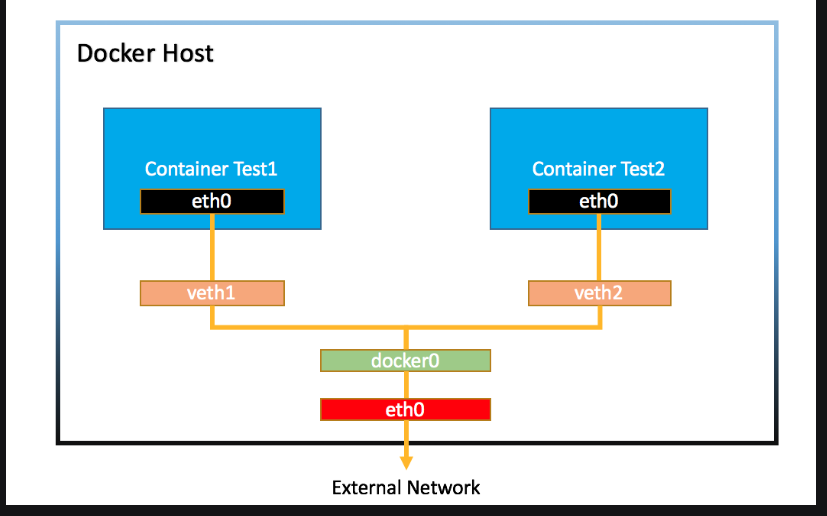
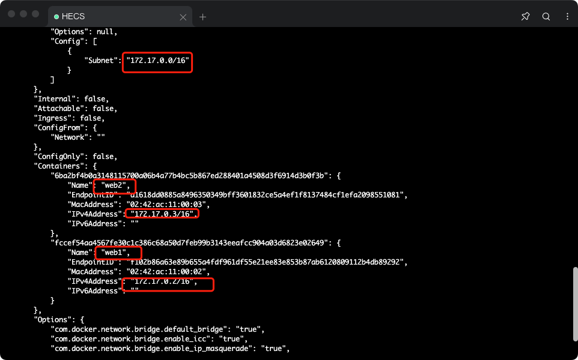

# Docker

------


# 1.常用的docker命令


```
cd "C:\Program Files\Docker\Docker"

DockerCli.exe -SwitchDaemon
```


```powershell
docker 

docker info
// 列出当前容器
docker container ps 
// 列出当前所有容器包括停止的
docker container ps -a
// 查看当前 image列表
docker image ls
//删除iamge 
docker image rm [name or id前几位]
//列出当前启动容器列表
docker container ls
//包括已经停运的容器
docker container ps -a
```

创建容器 

```powershell
 docker container run nginx
```

停止一个容器

```shell
docker container stop [name or ID前几位]
// 停止多个容器
docker container ps -aq 
docker container stop $(docker container ps -qa)
```

删除一个容器

```powershell
docker rm [name or ID前几位]
// 删除多个容器
docker rm $(docker ps -qa)
```

docker中不能直接删除一个正在运行的容器

# 2.容器的两种模式

## 1.attached模式（前台执行模式）

```powershell
//启动一个nginx服务将端口映射到外部80端口
docker run -p 80:80 nginx
```

win 的 ctrl+c不会停止一个容器 linux中 ctrl+c 会停止容器的运行

## 2.detached模式（后台执行模式）

```powershell
docker run -d -p 80:80 nginx
//重新attach到容器中
docker attch fa3(容器id)
// detached模式下 查看某个容器日志
docker logs (容器Id)
//动态跟踪logs
docker logs -f (容器Id)
```

d==>detached

# 3.容器交互式模式

## 1.直接创建

首先 我们创建出一个可交互的ubuntu

```powershell
docker container run -it ubuntu sh
// -it 交互式模式 
// sh 执行sh 命令
```


如此便可得到一个可交互的ubuntu的系统

通过exit退出交互式

exit  退出之后 此容器也会停止运行


## 2.进入detached模式下的交互式模式


首先启动一个nginx服务

```powershell
docker container run -d -p 80:80 nginx
```


```powershell
docker exec -it [ID] sh
// exec 执行
//-it 交互式 
// sh 以shell形式
```


此时 exit  我们的容器并不会 停止运行


```powershell
docker top c2f
// 查看此容器启动的进程
```


## 3.docker container run 背后发生了什么？

```powershell
$ docker container run -d --publish 80:80 --name webhost nginx

// -d 后台执行
// publish ====> -p 端口映射
// name webhost 给镜像一个名字 如果不写 也会随机一个名字
```

- 1. 在本地查找是否有nginx这个image镜像，但是没有发现
- 1. 去远程的image registry查找nginx镜像（默认的registry是Docker Hub)
- 1. 下载最新版本的nginx镜像 （nginx:latest 默认)
- 1. 基于nginx镜像来创建一个新的容器，并且准备运行
- 1. docker engine分配给这个容器一个虚拟IP地址
- 1. 在宿主机上打开80端口并把容器的80端口转发到宿主机上
- 1. 启动容器，运行指定的命令（这里是一个shell脚本去启动nginx）

# 4.镜像的创建管理和发布


## 1.镜像的获取

- pull from `registry` (online) 从registry拉取
  - public（公有）
  - private（私有）
- build from `Dockerfile` (online) 从Dockerfile构建
- load from `file` (offline) 文件导入 （离线）


```powershell
docker image pull nginx
```

## 2.镜像的获取查看和删除


拉取固定版本

```
docker image pull nginx:1.20.0
```


从quay上拉去镜像

```
docker image pull quay.io/centos7/nginx-116-centos7 
```


查看docker image镜像跟多信息

```powershell
docker image inspect [ID]
```


可以查看到很多配置


镜像的删除

```powershell
docker image rm [ID]
```

注意:有正在运行的容器 是不能删除镜像的

要删除需要 先停止该镜像 之后再删除容器 最后再删除镜像

```powershell
docker container stop [ID]
docker container  ps -a
docker container rm [ID]
docker image rm [ID]
```

## 3.docker镜像的导出

1.导出

```powershell
docker image save nginx -o nginx.image
```


2.导入

```powershell
docker image load -i .\nginx.image
```


## 4.dockerfile介绍

- Dockerfile是用于构建docker镜像的文件
- Dockerfile里包含了构建镜像所需的“指令”
- Dockerfile有其特定的语法规则

## 5.镜像的构建和分享

以python为例子

构建Dockerfile文件

```dockerfile
FROM ubuntu:20.04
RUN apt-get update && \
    DEBIAN_FRONTEND=noninteractive apt-get install --no-install-recommends -y python3.9 python3-pip python3.9-dev
ADD hello.py /
CMD ["python3", "/hello.py"]
```

创建hello.py

```python
print("hello docker")
```

```powershell
docker image build -t hello .
// -t tag标签
//. 代表当前文件夹
```


image重命名

```powershell
docker image tag hello leon9907/hello:1.0
```

image上传dockerhub 

1.登录dockerbub

```powershell
docker login
```

2.上传image镜像

```powershell
 docker image push leon9907/hello:1.0
 //名字必须以自己id开头 冒号后标注tag
```


3.镜像的拉取

```powershell
docker pull leon9907/hello:1.0
```


## 6.通过commit创建镜像

```powershell
docker container commit fcb leon9907/nginx
docker container commit [ID] [dockerhub账号]/[镜像名称]
```

# 5.dockerfile完全指南

## 1.基础镜像的选择 (FROM)

基本原则

- 官方镜像优于非官方的镜像，如果没有官方镜像，则尽量选择Dockerfile开源的
- 固定版本tag而不是每次都使用latest
- 尽量选择体积小的镜像


dockerfile 常用常用语法(COPY && ADD)

```dockerfile
COPY --复制所在文件夹文件
ADD  --复制所在文件夹文件 如果为tar.gz或者其他压缩格式 会自动解压
WORKDIR --类似于linux中cd  切换路径  如果目标路径不存在 会自动创建一个目录
```

```dockerfile
FROM python:3.9.5-alpine3.13
COPY hello.py /app/hello.py
```

```dockerfile
FROM python:3.9.5-alpine3.13
ADD hello.tar.gz /app/
```

```dockerfile
FROM python:3.9.5-alpine3.13
WORKDIR /app
COPY hello.py hello.py
```

## 2.构建参数和环境变量(ARG && ENV)

ENV

```dockerfile
FROM ubuntu:20.04
ENV VERSION=2.0.1
RUN apt-get update && \
    apt-get install -y wget && \
    wget https://github.com/ipinfo/cli/releases/download/ipinfo-${VERSION}/ipinfo_${VERSION}_linux_amd64.tar.gz && \
    tar zxf ipinfo_${VERSION}_linux_amd64.tar.gz && \
    mv ipinfo_${VERSION}_linux_amd64 /usr/bin/ipinfo && \
    rm -rf ipinfo_${VERSION}_linux_amd64.tar.gz
```

ARG

```dockerfile
FROM ubuntu:20.04
ARG VERSION=2.0.1
RUN apt-get update && \
    apt-get install -y wget && \
    wget https://github.com/ipinfo/cli/releases/download/ipinfo-${VERSION}/ipinfo_${VERSION}_linux_amd64.tar.gz && \
    tar zxf ipinfo_${VERSION}_linux_amd64.tar.gz && \
    mv ipinfo_${VERSION}_linux_amd64 /usr/bin/ipinfo && \
    rm -rf ipinfo_${VERSION}_linux_amd64.tar.gz
```

区别

```powershell
docker image build -f .\Dockerfile-arg -t ipinfo-arg-2.0.0 --build-arg VERSION=2.0.0 .
```

ARG 可以在镜像build的时候动态修改value, 通过 `--build-arg`

ENV 设置的变量可以在Image中保持，并在容器中的环境变量里

## 3.CMD容器启动命令

CMD可以用来设置容器启动时默认会执行的命令。

- 容器启动时默认执行的命令

- 如果docker container run启动容器时指定了其它命令，则CMD命令会被忽略

- 如果定义了多个CMD，只有最后一个会被执行

删除已经退出的docker container

  ```powershell
  docker system prune -f 
  ```

删除目前已经没有使用的image

```powershell
docker image prune -a
```

查看某个image的层级

```powershell
docker image history [image name]
```

运行结束即自动删除 container

```powershell
docker container run --rm -it ipinfo ipinfo 8.8.8.8
```

## 4.容器启动命令ENTRYPOINT

ENTRYPOINT 也可以设置容器启动时要执行的命令，但是和CMD是有区别的。

- `CMD` 设置的命令，可以在docker container run 时传入其它命令，覆盖掉 `CMD` 的命令，但是 `ENTRYPOINT` 所设置的命令是一定会被执行的。
- `ENTRYPOINT` 和 `CMD` 可以联合使用，`ENTRYPOINT` 设置执行的命令，CMD传递参数

```dockerfile
FROM ubuntu:20.04
ENTRYPOINT ["echo", "hello docker"]
```

```dockerfile
FROM ubuntu:20.04
ENTRYPOINT ["echo"]
CMD []
```

## 5.Shell 格式和 Exec 格式

CMD和ENTRYPOINT同时支持shell格式和Exec格式。

Shell格式

```dockerfile
CMD echo "hello docker"
ENTRYPOINT echo "hello docker"
```

Exec格式

```dockerfile
ENTRYPOINT ["echo", "hello docker"]
CMD ["echo", "hello docker"]
```

假如我们要把上面的CMD改成Exec格式，下面这样改是不行的, 大家可以试试。

```dockerfile
FROM ubuntu:20.04
ENV NAME=docker
CMD ["echo", "hello $NAME"]
```

它会打印出 `hello $NAME` , 而不是 `hello docker` ,那么需要怎么写呢？ 我们需要以shell脚本的方式去执行

```dockerfile
FROM ubuntu:20.04
ENV NAME=docker
CMD ["sh", "-c", "echo hello $NAME"]
```

## 6.一起构建一个nodejs-express的镜像

```powershell
npm init -y
npm i express
```

app.js

```javascript
const express = require('express')
const app = express()
app.get('/', (req, res) => {
    res.send('hello,docker express')
})
app.listen(3000)
console.log('网站服务器启动成功')
```

dockerfile

```dockerfile
FROM node

WORKDIR /app/

COPY package.json /app/

COPY app.js /app/

RUN npm install

EXPOSE 3000

CMD ["node","app.js","-h","0.0.0.0"]
```

打包

```powershell
docker image build -t flask-node-demo .
```

运行

```powershell
docker container run -it -p 3000:3000 flask-node-demo
```


如此本机就可以访问到我们定义的接口咯

## 7.dockerignore文件

## 什么是Docker build context

Docker是client-server架构，理论上Client和Server可以不在一台机器上。

在构建docker镜像的时候，需要把所需要的文件由CLI（client）发给Server，这些文件实际上就是build context

文件命名为

```.dockerignore
.dockerignore
```

```
.vscode/
env/
```

文件内部写哪个文件夹 打包的时候就忽略哪个文件夹

## 8.多阶段构建

```dockerfile
FROM gcc:9.4 AS builder

COPY hello.c /src/hello.c

WORKDIR /src

RUN gcc --static -o hello hello.c


FROM alpine:3.13.5

COPY --from=builder /src/hello /src/hello

ENTRYPOINT [ "/src/hello" ]

CMD []
```

## 9.尽量使用非root用户

```dockerfile
FROM python:3.9.5-slim

RUN pip install flask && \
    groupadd -r flask && useradd -r -g flask flask && \
    mkdir /src && \
    chown -R flask:flask /src

USER flask

COPY app.py /src/app.py

WORKDIR /src
ENV FLASK_APP=app.py

EXPOSE 5000

CMD ["flask", "run", "-h", "0.0.0.0"]
```

# 6.docker的存储

## 1.data Volume

  是一个持久化数据的技术（个人理解）

准备镜像[#](https://dockertips.readthedocs.io/en/latest/docker-volume/data-volume-mysql.html#id1)

```powershell
$ docker pull mysql
$ docker image ls
REPOSITORY   TAG       IMAGE ID       CREATED        SIZE
mysql        5.7       2c9028880e58   5 weeks ago    447MB

$ docker container run --name some-mysql -e MYSQL_ROOT_PASSWORD=my-secret-pw -d -v mysql-data:/var/lib/mysql mysql
02206eb369be08f660bf86b9d5be480e24bb6684c8a938627ebfbcfc0fd9e48e
```

my-secret-pw 为容器内mysql密码

-v mysql-data:/var/lib/mysql 指定 data volume

此后此容器可以删除也没有问题 再启动下一个mysql容器的时候 制定data volume地址即可

## 2.Bind Mount

可以写到指定路径 支持windos


## 3.多个机器之间的容器共享数据（docker volume driver）


官方参考链接 https://docs.docker.com/storage/volumes/#share-data-among-machines

Docker的volume支持多种driver。默认创建的volume driver都是local

```powershell
$ docker volume inspect vscode
[
    {
        "CreatedAt": "2021-06-23T21:33:57Z",
        "Driver": "local",
        "Labels": null,
        "Mountpoint": "/var/lib/docker/volumes/vscode/_data",
        "Name": "vscode",
        "Options": null,
        "Scope": "local"
    }
]
```


这一节我们看看一个叫sshfs的driver，如何让docker使用不在同一台机器上的文件系统做volume

## 环境准备

准备三台Linux机器，之间可以通过SSH相互通信。

| hostname     | ip             | ssh username | ssh password |
| ------------ | -------------- | ------------ | ------------ |
| docker-host1 | 192.168.200.10 | vagrant      | vagrant      |
| docker-host2 | 192.168.200.11 | vagrant      | vagrant      |
| docker-host3 | 192.168.200.12 | vagrant      | vagrant      |

## 安装plugin

在其中两台机器上安装一个plugin `vieux/sshfs`

```powershell
[vagrant@docker-host1 ~]$ docker plugin install --grant-all-permissions vieux/sshfs
latest: Pulling from vieux/sshfs
Digest: sha256:1d3c3e42c12138da5ef7873b97f7f32cf99fb6edde75fa4f0bcf9ed277855811
52d435ada6a4: Complete
Installed plugin vieux/sshfs
```


```powershell
[vagrant@docker-host2 ~]$ docker plugin install --grant-all-permissions vieux/sshfs
latest: Pulling from vieux/sshfs
Digest: sha256:1d3c3e42c12138da5ef7873b97f7f32cf99fb6edde75fa4f0bcf9ed277855811
52d435ada6a4: Complete
Installed plugin vieux/sshfs
```


## 创建volume

```powershell
[vagrant@docker-host1 ~]$ docker volume create --driver vieux/sshfs \
                          -o sshcmd=vagrant@192.168.200.12:/home/vagrant \
                          -o password=vagrant \
                          sshvolume
```


查看

```powershell
[vagrant@docker-host1 ~]$ docker volume ls
DRIVER               VOLUME NAME
vieux/sshfs:latest   sshvolume
[vagrant@docker-host1 ~]$ docker volume inspect sshvolume
[
    {
        "CreatedAt": "0001-01-01T00:00:00Z",
        "Driver": "vieux/sshfs:latest",
        "Labels": {},
        "Mountpoint": "/mnt/volumes/f59e848643f73d73a21b881486d55b33",
        "Name": "sshvolume",
        "Options": {
            "password": "vagrant",
            "sshcmd": "vagrant@192.168.200.12:/home/vagrant"
        },
        "Scope": "local"
    }
]
```


## 创建容器挂载Volume

创建容器，挂载sshvolume到/app目录，然后进入容器的shell，在/app目录创建一个test.txt文件

```powershell
[vagrant@docker-host1 ~]$ docker run -it -v sshvolume:/app busybox sh
Unable to find image 'busybox:latest' locally
latest: Pulling from library/busybox
b71f96345d44: Pull complete
Digest: sha256:930490f97e5b921535c153e0e7110d251134cc4b72bbb8133c6a5065cc68580d
Status: Downloaded newer image for busybox:latest
/ #
/ # ls
app   bin   dev   etc   home  proc  root  sys   tmp   usr   var
/ # cd /app
/app # ls
/app # echo "this is ssh volume"> test.txt
/app # ls
test.txt
/app # more test.txt
this is ssh volume
/app #
/app #
```


这个文件我们可以在docker-host3上看到

```powershell
[vagrant@docker-host3 ~]$ pwd
/home/vagrant
[vagrant@docker-host3 ~]$ ls
test.txt
[vagrant@docker-host3 ~]$ more test.txt
this is ssh volume
```

# 7.docker的网络(linux下进行)

## 1.Linux下docker的安装

在linux下安装好docker环境

1、切换到root账户，输入su root，再输入密码即可。

 2、docker安装要求：

  Docker要求CentOS系统的内核版本高于 3.10 ，通过 uname -r 命令查看你当前的内核版本是否支持安账docker。

3、输入：sudo yum update

4、输入y，点击确定

5.继续输入y，点击确定

6、输入 sudo yum install -y yum-utils device-mapper-persistent-data lvm2

7、 输入：sudo yum-config-manager --add-repo https://download.docker.com/linux/centos/docker-ce.repo

官网地址

yum-config-manager --add-repo https://download.docker.com/linux/centos/docker-ce.repo

阿里云地址

yum-config-manager --add-repo http://mirrors.aliyun.com/docker-ce/linux/centos/docker-ce.repo　   

 8、选择特定版本安装：yum list docker-ce --showduplicates | sort -r

也可以直接安装：sudo yum install 3:19.03.5-3.el7　　　

 9、输入：sudo yum install docker-ce-17.12.0.ce，输入y，点击确定

10、 再输入y，点击确定

 11、这样就安装好了

 12、输入：docker version

 13、先输入：sudo systemctl start docker，再输入：sudo systemctl enable docker

 14、再次输入：docker version，出现了client和server就代表安装成功了。　　

 15、查看docker启动状态：systemctl status docker（如下图即启动成功）　　

16、卸载命令：

a.查询docker安装过的包：yum list installed | grep docker

b.删除安装包：yum remove docker-ce.x86_64 ddocker-ce-cli.x86_64 -y

c.删除镜像/容器等：rm -rf /var/lib/docker


## 2.Linux常用的命令

```
ifconfig
ip addr
```

网络连通性测试

ping命令（测试ip的连通性）windows

```powershell
ping 192.168.178.1
```

telnet命令(测试端口的连通性) windows

```powershell
telnet www.baidu.com 80
```

Linux下使用tracepath （路径探测跟踪）

```powershell
tracepath www.baidu.com
```

windows下使用 TRACERT.EXE

```powershell
TRACERT.EXE www.baidu.com
```

curl命令

请求web服务的


## 3.Docker Bridge 网络



Warning

注意，本节实验需要在Linux环境下进行

```powershell
docker network ls
docker network inspect [ID]
```



这些容器都会连接到docker0上 所以容器之间 是可以互相通信的 


Note

```powershell
brctl` 使用前需要安装, 对于CentOS, 可以通过 `sudo yum install -y bridge-utils` 安装. 对于Ubuntu, 可以通过 `sudo apt-get install -y bridge-utils


$ brctl show
bridge name     bridge id               STP enabled     interfaces
docker0         8000.0242759468cf       no              veth8c9bb82
                                                        vethd8f9afb
```


