# Docker1

------

# 1.常用的docker命令

```
cd "C:\Program Files\Docker\Docker"

DockerCli.exe -SwitchDaemon
```

```powershell
docker 

docker info
// 列出当前容器
docker container ps 
// 列出当前所有容器包括停止的
docker container ps -a
// 查看当前 image列表
docker image ls
//删除iamge 
docker image rm [name or id前几位]
//列出当前启动容器列表
docker container ls
//包括已经停运的容器
docker container ps -a
```

创建容器 

```powershell
 docker container run nginx
```

停止一个容器

```shell
docker container stop [name or ID前几位]
// 停止多个容器
docker container ps -aq 
docker container stop $(docker container ps -qa)
```

删除一个容器

```powershell
docker rm [name or ID前几位]
// 删除多个容器
docker rm $(docker ps -qa)
```

docker中不能直接删除一个正在运行的容器

# 2.容器的两种模式

## 1.attached模式（前台执行模式）

```powershell
//启动一个nginx服务将端口映射到外部80端口
docker run -p 80:80 nginx
```

win 的 ctrl+c不会停止一个容器 linux中 ctrl+c 会停止容器的运行

## 2.detached模式（后台执行模式）

```powershell
docker run -d -p 80:80 nginx
//重新attach到容器中
docker attch fa3(容器id)
// detached模式下 查看某个容器日志
docker logs (容器Id)
//动态跟踪logs
docker logs -f (容器Id)
```

d==>detached

# 3.容器交互式模式

## 1.直接创建

首先 我们创建出一个可交互的ubuntu

```powershell
docker container run -it ubuntu sh
// -it 交互式模式 
// sh 执行sh 命令
```


如此便可得到一个可交互的ubuntu的系统

通过exit退出交互式

exit  退出之后 此容器也会停止运行

## 2.进入detached模式下的交互式模式

首先启动一个nginx服务

```powershell
docker container run -d -p 80:80 nginx
```

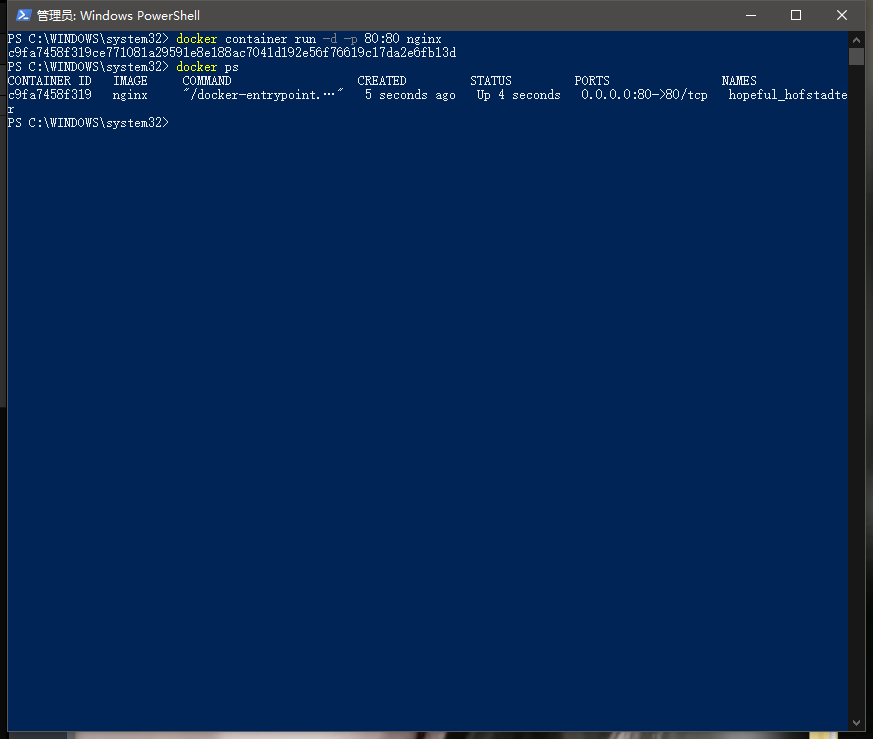

```powershell
docker exec -it [ID] sh
// exec 执行
//-it 交互式 
// sh 以shell形式
```

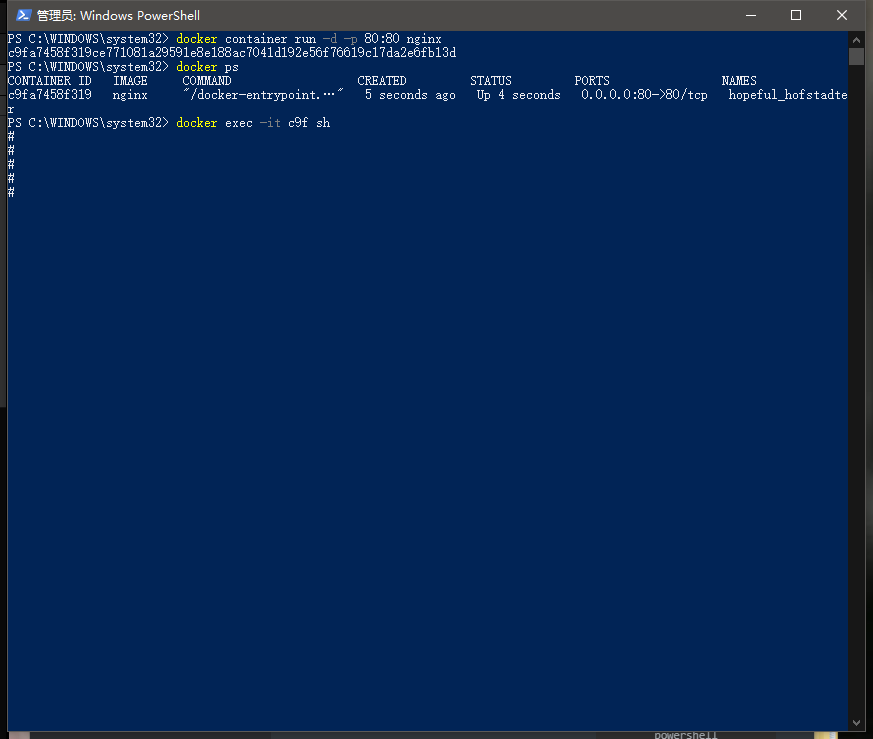

此时 exit  我们的容器并不会 停止运行

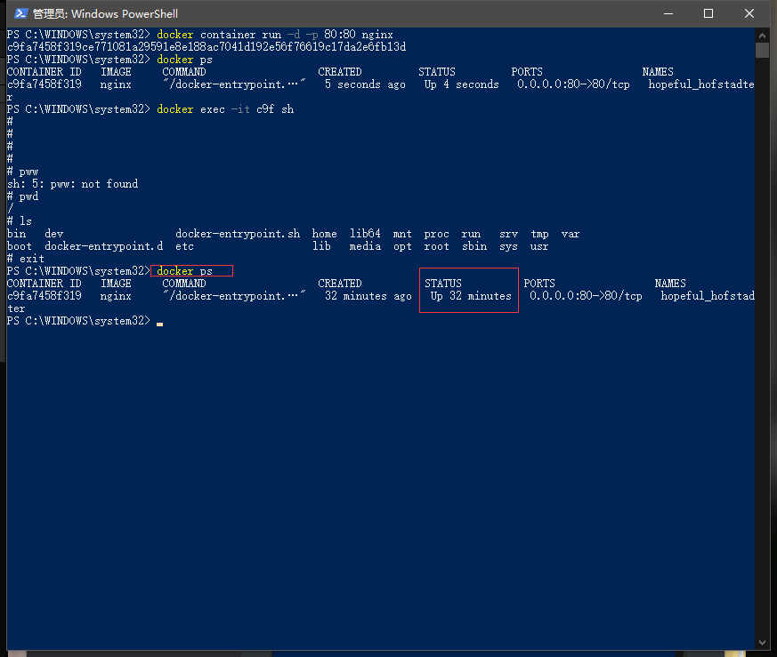

```powershell
docker top c2f
// 查看此容器启动的进程
```

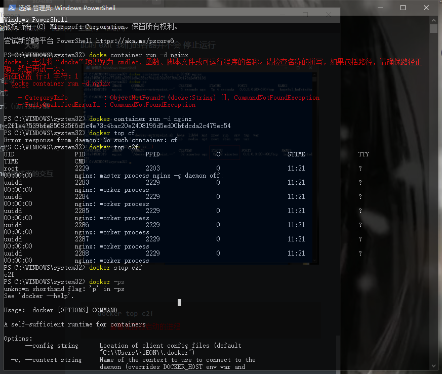

## 3.docker container run 背后发生了什么？

```powershell
$ docker container run -d --publish 80:80 --name webhost nginx

// -d 后台执行
// publish ====> -p 端口映射
// name webhost 给镜像一个名字 如果不写 也会随机一个名字
```

- 1. 在本地查找是否有nginx这个image镜像，但是没有发现
- 1. 去远程的image registry查找nginx镜像（默认的registry是Docker Hub)
- 1. 下载最新版本的nginx镜像 （nginx:latest 默认)
- 1. 基于nginx镜像来创建一个新的容器，并且准备运行
- 1. docker engine分配给这个容器一个虚拟IP地址
- 1. 在宿主机上打开80端口并把容器的80端口转发到宿主机上
- 1. 启动容器，运行指定的命令（这里是一个shell脚本去启动nginx）

# 4.镜像的创建管理和发布

## 1.镜像的获取

- pull from `registry` (online) 从registry拉取
  - public（公有）
  - private（私有）
- build from `Dockerfile` (online) 从Dockerfile构建
- load from `file` (offline) 文件导入 （离线）

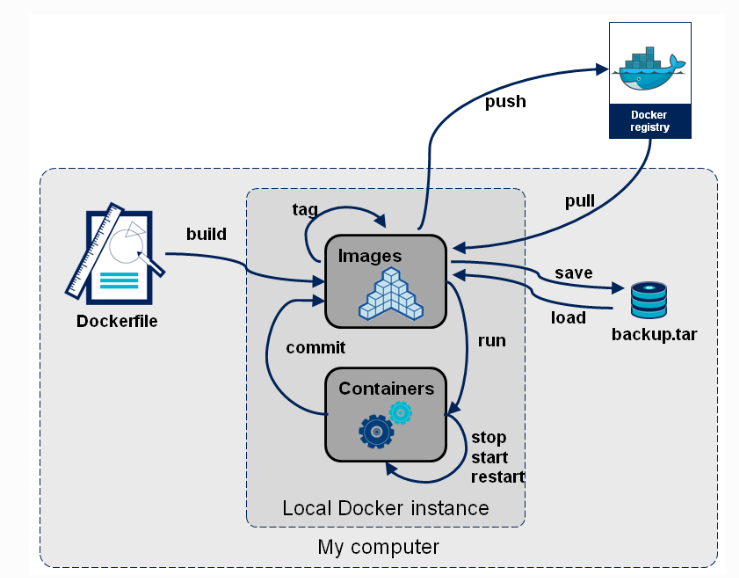

```powershell
docker image pull nginx
```

## 2.镜像的获取查看和删除

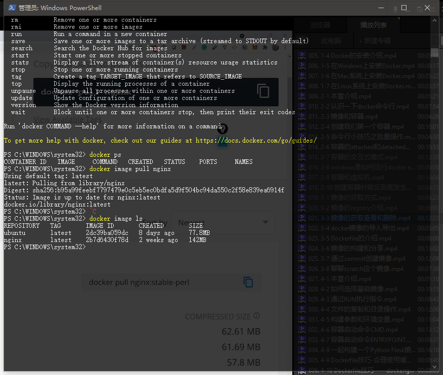

拉取固定版本

```
docker image pull nginx:1.20.0
```

从quay上拉去镜像

```
docker image pull quay.io/centos7/nginx-116-centos7 
```

查看docker image镜像跟多信息

```powershell
docker image inspect [ID]
```

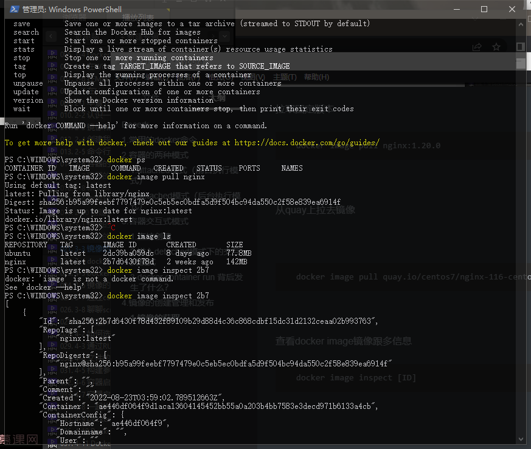

可以查看到很多配置

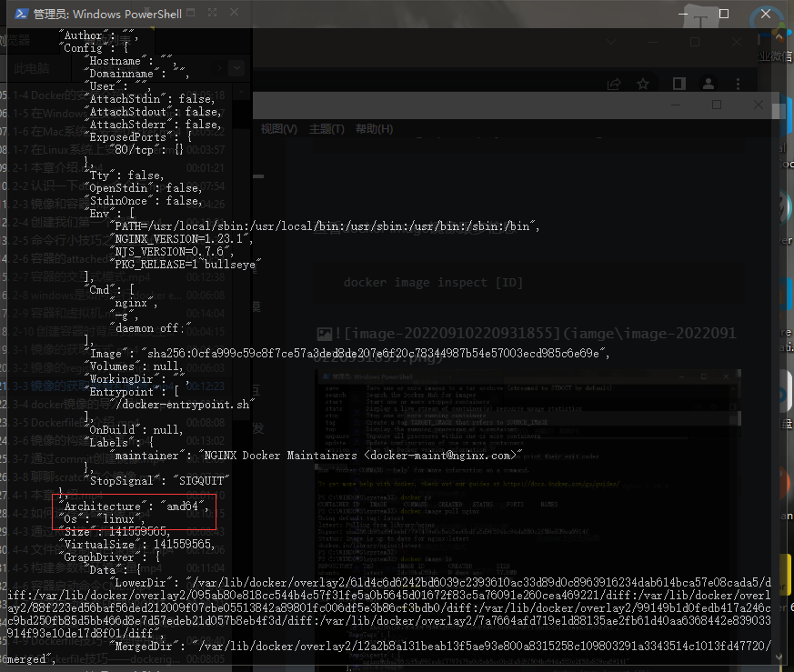

镜像的删除

```powershell
docker image rm [ID]
```

注意:有正在运行的容器 是不能删除镜像的

要删除需要 先停止该镜像 之后再删除容器 最后再删除镜像

```powershell
docker container stop [ID]
docker container  ps -a
docker container rm [ID]
docker image rm [ID]
```

## 3.docker镜像的导出

1.导出

```powershell
docker image save nginx -o nginx.image
```


2.导入

```powershell
docker image load -i .\nginx.image
```

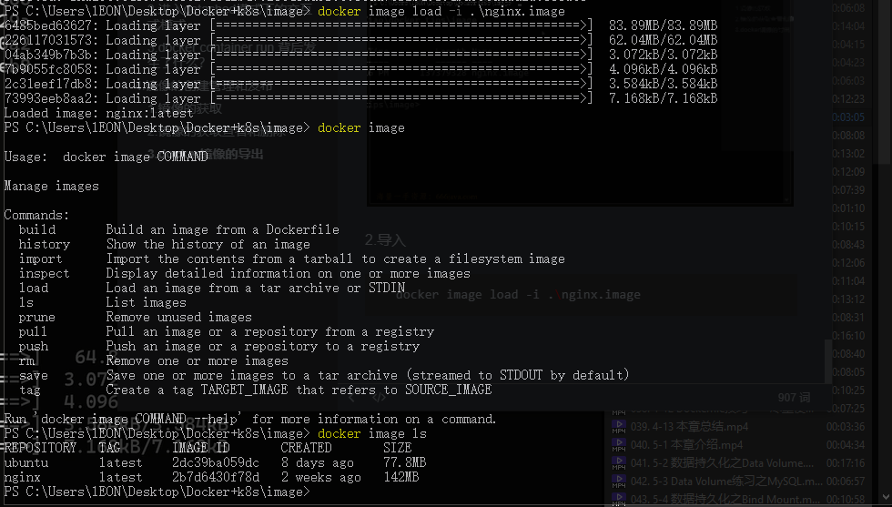

## 4.dockerfile介绍

- Dockerfile是用于构建docker镜像的文件
- Dockerfile里包含了构建镜像所需的“指令”
- Dockerfile有其特定的语法规则

## 5.镜像的构建和分享

以python为例子

构建Dockerfile文件

```dockerfile
FROM ubuntu:20.04
RUN apt-get update && \
    DEBIAN_FRONTEND=noninteractive apt-get install --no-install-recommends -y python3.9 python3-pip python3.9-dev
ADD hello.py /
CMD ["python3", "/hello.py"]
```

创建hello.py

```python
print("hello docker")
```

```powershell
docker image build -t hello .
// -t tag标签
//. 代表当前文件夹
```

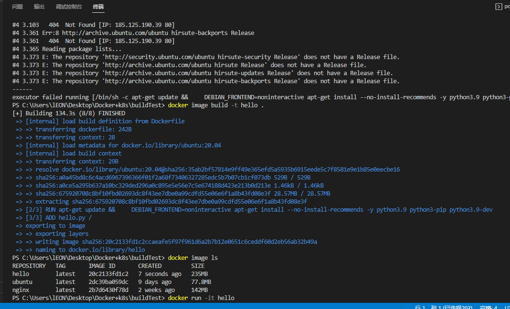

image重命名

```powershell
docker image tag hello leon9907/hello:1.0
```

image上传dockerhub 

1.登录dockerbub

```powershell
docker login
```

2.上传image镜像

```powershell
 docker image push leon9907/hello:1.0
 //名字必须以自己id开头 冒号后标注tag
```

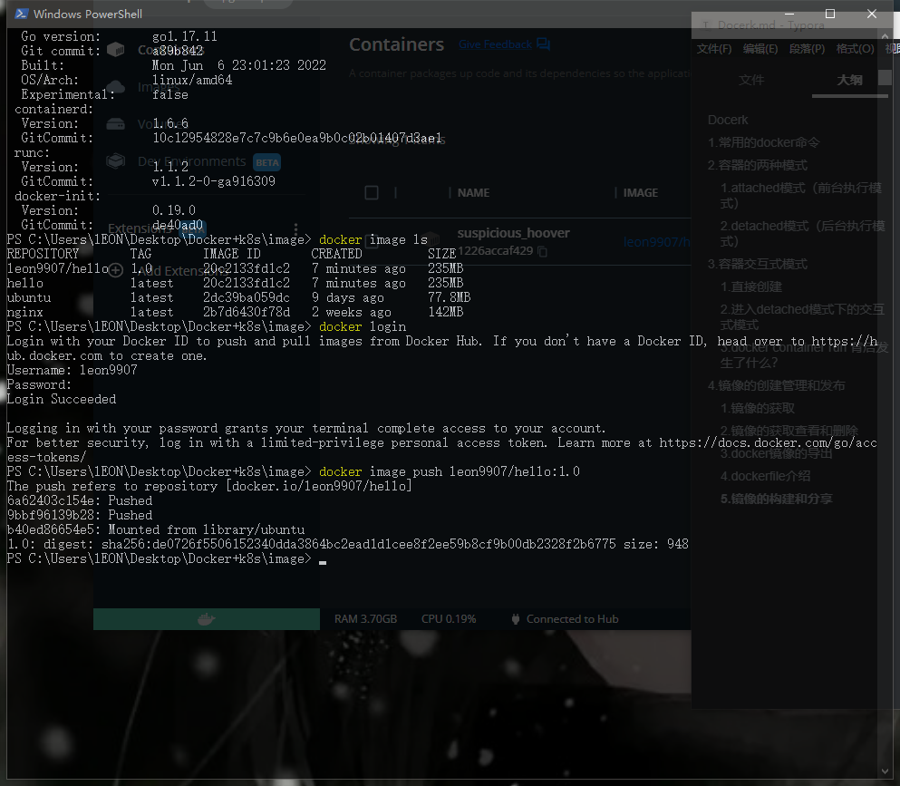

3.镜像的拉取

```powershell
docker pull leon9907/hello:1.0
```

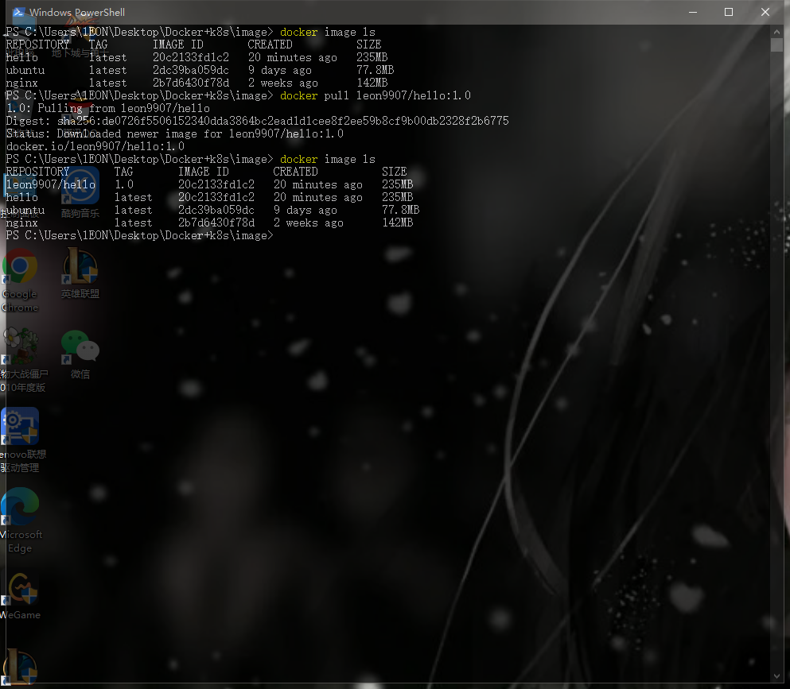

## 6.通过commit创建镜像

```powershell
docker container commit fcb leon9907/nginx
docker container commit [ID] [dockerhub账号]/[镜像名称]
```

# 5.dockerfile完全指南

## 1.基础镜像的选择 (FROM)

基本原则

- 官方镜像优于非官方的镜像，如果没有官方镜像，则尽量选择Dockerfile开源的
- 固定版本tag而不是每次都使用latest
- 尽量选择体积小的镜像

dockerfile 常用常用语法(COPY && ADD)

```dockerfile
COPY --复制所在文件夹文件
ADD  --复制所在文件夹文件 如果为tar.gz或者其他压缩格式 会自动解压
WORKDIR --类似于linux中cd  切换路径  如果目标路径不存在 会自动创建一个目录
```

```dockerfile
FROM python:3.9.5-alpine3.13
COPY hello.py /app/hello.py
```

```dockerfile
FROM python:3.9.5-alpine3.13
ADD hello.tar.gz /app/
```

```dockerfile
FROM python:3.9.5-alpine3.13
WORKDIR /app
COPY hello.py hello.py
```

## 2.构建参数和环境变量(ARG && ENV)

ENV

```dockerfile
FROM ubuntu:20.04
ENV VERSION=2.0.1
RUN apt-get update && \
    apt-get install -y wget && \
    wget https://github.com/ipinfo/cli/releases/download/ipinfo-${VERSION}/ipinfo_${VERSION}_linux_amd64.tar.gz && \
    tar zxf ipinfo_${VERSION}_linux_amd64.tar.gz && \
    mv ipinfo_${VERSION}_linux_amd64 /usr/bin/ipinfo && \
    rm -rf ipinfo_${VERSION}_linux_amd64.tar.gz
```

ARG

```dockerfile
FROM ubuntu:20.04
ARG VERSION=2.0.1
RUN apt-get update && \
    apt-get install -y wget && \
    wget https://github.com/ipinfo/cli/releases/download/ipinfo-${VERSION}/ipinfo_${VERSION}_linux_amd64.tar.gz && \
    tar zxf ipinfo_${VERSION}_linux_amd64.tar.gz && \
    mv ipinfo_${VERSION}_linux_amd64 /usr/bin/ipinfo && \
    rm -rf ipinfo_${VERSION}_linux_amd64.tar.gz
```

区别

```powershell
docker image build -f .\Dockerfile-arg -t ipinfo-arg-2.0.0 --build-arg VERSION=2.0.0 .
```

ARG 可以在镜像build的时候动态修改value, 通过 `--build-arg`

ENV 设置的变量可以在Image中保持，并在容器中的环境变量里

## 3.CMD容器启动命令

CMD可以用来设置容器启动时默认会执行的命令。

- 容器启动时默认执行的命令

- 如果docker container run启动容器时指定了其它命令，则CMD命令会被忽略

- 如果定义了多个CMD，只有最后一个会被执行

删除已经退出的docker container

```powershell
docker system prune -f 
```

删除目前已经没有使用的image

```powershell
docker image prune -a
```

查看某个image的层级

```powershell
docker image history [image name]
```

运行结束即自动删除 container

```powershell
docker container run --rm -it ipinfo ipinfo 8.8.8.8
```

## 4.容器启动命令ENTRYPOINT

ENTRYPOINT 也可以设置容器启动时要执行的命令，但是和CMD是有区别的。

- `CMD` 设置的命令，可以在docker container run 时传入其它命令，覆盖掉 `CMD` 的命令，但是 `ENTRYPOINT` 所设置的命令是一定会被执行的。
- `ENTRYPOINT` 和 `CMD` 可以联合使用，`ENTRYPOINT` 设置执行的命令，CMD传递参数

```dockerfile
FROM ubuntu:20.04
ENTRYPOINT ["echo", "hello docker"]
```

```dockerfile
FROM ubuntu:20.04
ENTRYPOINT ["echo"]
CMD []
```

## 5.Shell 格式和 Exec 格式

CMD和ENTRYPOINT同时支持shell格式和Exec格式。

Shell格式

```dockerfile
CMD echo "hello docker"
ENTRYPOINT echo "hello docker"
```

Exec格式

```dockerfile
ENTRYPOINT ["echo", "hello docker"]
CMD ["echo", "hello docker"]
```

假如我们要把上面的CMD改成Exec格式，下面这样改是不行的, 大家可以试试。

```dockerfile
FROM ubuntu:20.04
ENV NAME=docker
CMD ["echo", "hello $NAME"]
```

它会打印出 `hello $NAME` , 而不是 `hello docker` ,那么需要怎么写呢？ 我们需要以shell脚本的方式去执行

```dockerfile
FROM ubuntu:20.04
ENV NAME=docker
CMD ["sh", "-c", "echo hello $NAME"]
```

## 6.一起构建一个nodejs-express的镜像

```powershell
npm init -y
npm i express
```

app.js

```javascript
const express = require('express')
const app = express()
app.get('/', (req, res) => {
    res.send('hello,docker express')
})
app.listen(3000)
console.log('网站服务器启动成功')
```

dockerfile

```dockerfile
FROM node

WORKDIR /app/

COPY package.json /app/

COPY app.js /app/

RUN npm install

EXPOSE 3000

CMD ["node","app.js","-h","0.0.0.0"]
```

打包

```powershell
docker image build -t flask-node-demo .
```

运行

```powershell
docker container run -it -p 3000:3000 flask-node-demo
```

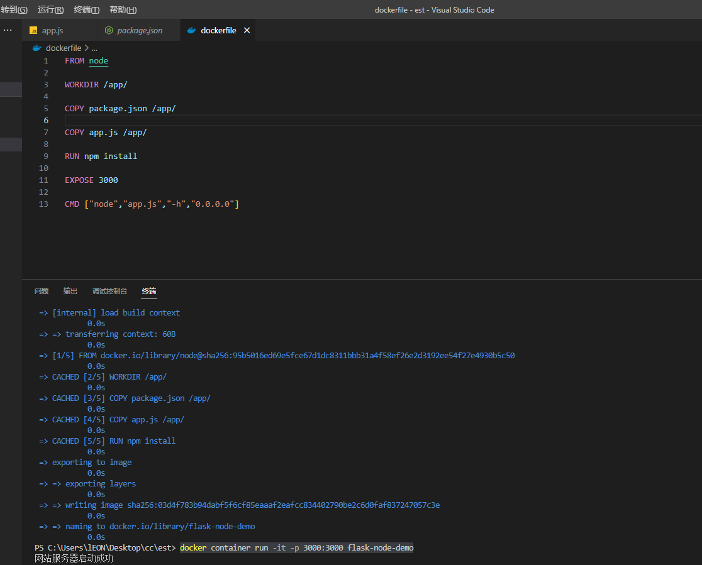

如此本机就可以访问到我们定义的接口咯

## 7.dockerignore文件

## 什么是Docker build context

Docker是client-server架构，理论上Client和Server可以不在一台机器上。

在构建docker镜像的时候，需要把所需要的文件由CLI（client）发给Server，这些文件实际上就是build context

文件命名为

```.dockerignore
.dockerignore
```

```
.vscode/
env/
```

文件内部写哪个文件夹 打包的时候就忽略哪个文件夹

## 8.多阶段构建

```dockerfile
FROM gcc:9.4 AS builder

COPY hello.c /src/hello.c

WORKDIR /src

RUN gcc --static -o hello hello.c


FROM alpine:3.13.5

COPY --from=builder /src/hello /src/hello

ENTRYPOINT [ "/src/hello" ]

CMD []
```

## 9.尽量使用非root用户

```dockerfile
FROM python:3.9.5-slim

RUN pip install flask && \
    groupadd -r flask && useradd -r -g flask flask && \
    mkdir /src && \
    chown -R flask:flask /src

USER flask

COPY app.py /src/app.py

WORKDIR /src
ENV FLASK_APP=app.py

EXPOSE 5000

CMD ["flask", "run", "-h", "0.0.0.0"]
```

# 6.docker的存储

## 1.data Volume

  是一个持久化数据的技术（个人理解）

准备镜像[#](https://dockertips.readthedocs.io/en/latest/docker-volume/data-volume-mysql.html#id1)

```powershell
$ docker pull mysql
$ docker image ls
REPOSITORY   TAG       IMAGE ID       CREATED        SIZE
mysql        5.7       2c9028880e58   5 weeks ago    447MB

$ docker container run --name some-mysql -e MYSQL_ROOT_PASSWORD=my-secret-pw -d -v mysql-data:/var/lib/mysql mysql
02206eb369be08f660bf86b9d5be480e24bb6684c8a938627ebfbcfc0fd9e48e
```

my-secret-pw 为容器内mysql密码

-v mysql-data:/var/lib/mysql 指定 data volume

此后此容器可以删除也没有问题 再启动下一个mysql容器的时候 制定data volume地址即可

## 2.Bind Mount

可以写到指定路径 支持windos

## 3.多个机器之间的容器共享数据（docker volume driver）


官方参考链接 https://docs.docker.com/storage/volumes/#share-data-among-machines

Docker的volume支持多种driver。默认创建的volume driver都是local

```powershell
$ docker volume inspect vscode
[
    {
        "CreatedAt": "2021-06-23T21:33:57Z",
        "Driver": "local",
        "Labels": null,
        "Mountpoint": "/var/lib/docker/volumes/vscode/_data",
        "Name": "vscode",
        "Options": null,
        "Scope": "local"
    }
]
```

这一节我们看看一个叫sshfs的driver，如何让docker使用不在同一台机器上的文件系统做volume

## 环境准备

准备三台Linux机器，之间可以通过SSH相互通信。

| hostname     | ip             | ssh username | ssh password |
| ------------ | -------------- | ------------ | ------------ |
| docker-host1 | 192.168.200.10 | vagrant      | vagrant      |
| docker-host2 | 192.168.200.11 | vagrant      | vagrant      |
| docker-host3 | 192.168.200.12 | vagrant      | vagrant      |

## 安装plugin

在其中两台机器上安装一个plugin `vieux/sshfs`

```powershell
[vagrant@docker-host1 ~]$ docker plugin install --grant-all-permissions vieux/sshfs
latest: Pulling from vieux/sshfs
Digest: sha256:1d3c3e42c12138da5ef7873b97f7f32cf99fb6edde75fa4f0bcf9ed277855811
52d435ada6a4: Complete
Installed plugin vieux/sshfs
```

```powershell
[vagrant@docker-host2 ~]$ docker plugin install --grant-all-permissions vieux/sshfs
latest: Pulling from vieux/sshfs
Digest: sha256:1d3c3e42c12138da5ef7873b97f7f32cf99fb6edde75fa4f0bcf9ed277855811
52d435ada6a4: Complete
Installed plugin vieux/sshfs
```

## 创建volume

```powershell
[vagrant@docker-host1 ~]$ docker volume create --driver vieux/sshfs \
                          -o sshcmd=vagrant@192.168.200.12:/home/vagrant \
                          -o password=vagrant \
                          sshvolume
```

查看

```powershell
[vagrant@docker-host1 ~]$ docker volume ls
DRIVER               VOLUME NAME
vieux/sshfs:latest   sshvolume
[vagrant@docker-host1 ~]$ docker volume inspect sshvolume
[
    {
        "CreatedAt": "0001-01-01T00:00:00Z",
        "Driver": "vieux/sshfs:latest",
        "Labels": {},
        "Mountpoint": "/mnt/volumes/f59e848643f73d73a21b881486d55b33",
        "Name": "sshvolume",
        "Options": {
            "password": "vagrant",
            "sshcmd": "vagrant@192.168.200.12:/home/vagrant"
        },
        "Scope": "local"
    }
]
```

## 创建容器挂载Volume

创建容器，挂载sshvolume到/app目录，然后进入容器的shell，在/app目录创建一个test.txt文件

```powershell
[vagrant@docker-host1 ~]$ docker run -it -v sshvolume:/app busybox sh
Unable to find image 'busybox:latest' locally
latest: Pulling from library/busybox
b71f96345d44: Pull complete
Digest: sha256:930490f97e5b921535c153e0e7110d251134cc4b72bbb8133c6a5065cc68580d
Status: Downloaded newer image for busybox:latest
/ #
/ # ls
app   bin   dev   etc   home  proc  root  sys   tmp   usr   var
/ # cd /app
/app # ls
/app # echo "this is ssh volume"> test.txt
/app # ls
test.txt
/app # more test.txt
this is ssh volume
/app #
/app #
```

这个文件我们可以在docker-host3上看到

```powershell
[vagrant@docker-host3 ~]$ pwd
/home/vagrant
[vagrant@docker-host3 ~]$ ls
test.txt
[vagrant@docker-host3 ~]$ more test.txt
this is ssh volume
```

# 7.docker的网络(linux下进行)

## 1.Linux下docker的安装

在linux下安装好docker环境

1、切换到root账户，输入su root，再输入密码即可。

 2、docker安装要求：

  Docker要求CentOS系统的内核版本高于 3.10 ，通过 uname -r 命令查看你当前的内核版本是否支持安账docker。

3、输入：sudo yum update

4、输入y，点击确定

5.继续输入y，点击确定

6、输入 sudo yum install -y yum-utils device-mapper-persistent-data lvm2

7、 输入：sudo yum-config-manager --add-repo https://download.docker.com/linux/centos/docker-ce.repo

官网地址

yum-config-manager --add-repo https://download.docker.com/linux/centos/docker-ce.repo

阿里云地址

yum-config-manager --add-repo http://mirrors.aliyun.com/docker-ce/linux/centos/docker-ce.repo　   

 8、选择特定版本安装：yum list docker-ce --showduplicates | sort -r

也可以直接安装：sudo yum install 3:19.03.5-3.el7　　　

 9、输入：sudo yum install docker-ce-17.12.0.ce，输入y，点击确定

10、 再输入y，点击确定

 11、这样就安装好了

 12、输入：docker version

 13、先输入：sudo systemctl start docker，再输入：sudo systemctl enable docker

 14、再次输入：docker version，出现了client和server就代表安装成功了。　　

 15、查看docker启动状态：systemctl status docker（如下图即启动成功）　　

16、卸载命令：

a.查询docker安装过的包：yum list installed | grep docker

b.删除安装包：yum remove docker-ce.x86_64 ddocker-ce-cli.x86_64 -y

c.删除镜像/容器等：rm -rf /var/lib/docker

## 2.Linux常用的命令

```
ifconfig
ip addr
```

网络连通性测试

ping命令（测试ip的连通性）windows

```powershell
ping 192.168.178.1
```

telnet命令(测试端口的连通性) windows

```powershell
telnet www.baidu.com 80
```

Linux下使用tracepath （路径探测跟踪）

```powershell
tracepath www.baidu.com
```

windows下使用 TRACERT.EXE

```powershell
TRACERT.EXE www.baidu.com
```

curl命令

请求web服务的

## 3.Docker Bridge 网络

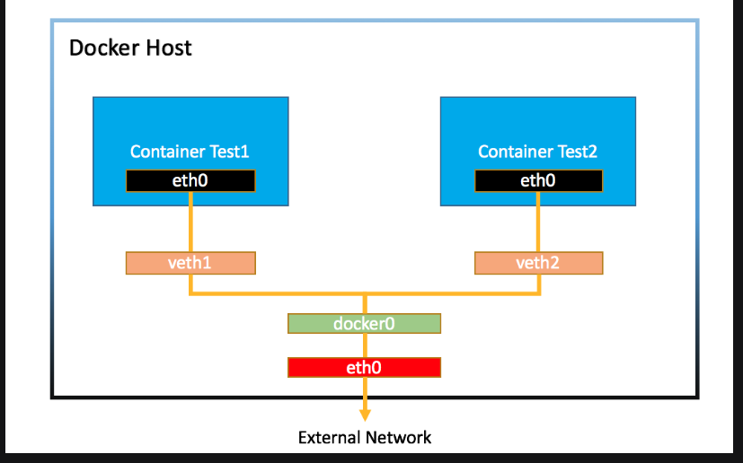

Warning

注意，本节实验需要在Linux环境下进行

```powershell
docker network ls #查看网络
docker network inspect [ID]
```

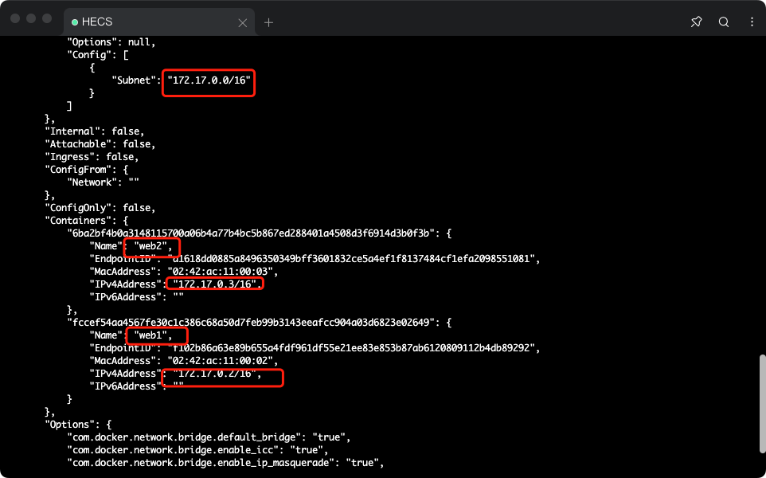

这些容器都会连接到docker0上 所以容器之间 是可以互相通信的 

Note

```powershell
brctl` 使用前需要安装, 对于CentOS, 可以通过 `sudo yum install -y bridge-utils` 安装. 对于Ubuntu, 可以通过 `sudo apt-get install -y bridge-utils


$ brctl show
bridge name     bridge id               STP enabled     interfaces
docker0         8000.0242759468cf       no              veth8c9bb82
                                                        vethd8f9afb
```

### 1.创建和使用自定义bridge

```powershell
[root@hecs-264568 ~]#docker network create -d bridge mybridge
5693d75bd369509099e4cd143319950565b36db5ef5a9790a39a4769420b49b2
[root@hecs-264568 ~]# docker network ls
NETWORK ID          NAME                DRIVER              SCOPE
14b0fa42269d        bridge              bridge              local
f33047206747        host                host                local
5693d75bd369        mybridge            bridge              local
7cc812dac06c        none    
查看一下网络情况
root@hecs-264568 ~]# docker network inspect mybridge
[
    {
        "Name": "mybridge",
        "Id": "5693d75bd369509099e4cd143319950565b36db5ef5a9790a39a4769420b49b2",
        "Created": "2022-11-17T10:34:54.03991162+08:00",
        "Scope": "local",
        "Driver": "bridge",
        "EnableIPv6": false,
        "IPAM": {
            "Driver": "default",
            "Options": {},
            "Config": [
                {
                    "Subnet": "172.18.0.0/16",
                    "Gateway": "172.18.0.1"
                }
            ]
        },
        "Internal": false,
        "Attachable": false,
        "Ingress": false,
        "ConfigFrom": {
            "Network": ""
        },
        "ConfigOnly": false,
        "Containers": {},
        "Options": {},
        "Labels": {}
    }
]
```

使用创建的网络(创建一个nginx容器)

```powershell
[root@hecs-264568 ~]# docker container  run -d --rm --name web1 --network mybridge -p 80:80  nginx
ab09d5e8da155970b64b82701da216cc2e238a5b328bb1317a974731342f12c0
[root@hecs-264568 ~]# docker container inspect ab
[
    {
        "Id": "ab09d5e8da155970b64b82701da216cc2e238a5b328bb1317a974731342f12c0",
        "Created": "2022-11-17T02:46:36.813791931Z",
        "Path": "/docker-entrypoint.sh",
        "Args": [
            "nginx",
            "-g",
            "daemon off;"
        ],
        "State": {
            "Status": "running",
            "Running": true,
            "Paused": false,
            "Restarting": false,
            "OOMKilled": false,
            "Dead": false,
            "Pid": 15156,
            "ExitCode": 0,
            "Error": "",
            "StartedAt": "2022-11-17T02:46:37.042878648Z",
            "FinishedAt": "0001-01-01T00:00:00Z"
        },
        "Image": "sha256:88736fe827391462a4db99252117f136b2b25d1d31719006326a437bb40cb12d",
        "ResolvConfPath": "/var/lib/docker/containers/ab09d5e8da155970b64b82701da216cc2e238a5b328bb1317a974731342f12c0/resolv.conf",
        "HostnamePath": "/var/lib/docker/containers/ab09d5e8da155970b64b82701da216cc2e238a5b328bb1317a974731342f12c0/hostname",
        "HostsPath": "/var/lib/docker/containers/ab09d5e8da155970b64b82701da216cc2e238a5b328bb1317a974731342f12c0/hosts",
        "LogPath": "/var/lib/docker/containers/ab09d5e8da155970b64b82701da216cc2e238a5b328bb1317a974731342f12c0/ab09d5e8da155970b64b82701da216cc2e238a5b328bb1317a974731342f12c0-json.log",
        "Name": "/web1",
        "RestartCount": 0,
        "Driver": "overlay2",
        "Platform": "linux",
        "MountLabel": "",
        "ProcessLabel": "",
        "AppArmorProfile": "",
        "ExecIDs": null,
        "HostConfig": {
            "Binds": null,
            "ContainerIDFile": "",
            "LogConfig": {
                "Type": "json-file",
                "Config": {}
            },
            "NetworkMode": "mybridge",
            "PortBindings": {
                "80/tcp": [
                    {
                        "HostIp": "",
                        "HostPort": "80"
                    }
                ]
            },
            "RestartPolicy": {
                "Name": "no",
                "MaximumRetryCount": 0
            },
            "AutoRemove": true,
            "VolumeDriver": "",
            "VolumesFrom": null,
            "CapAdd": null,
            "CapDrop": null,
            "Dns": [],
            "DnsOptions": [],
            "DnsSearch": [],
            "ExtraHosts": null,
            "GroupAdd": null,
            "IpcMode": "shareable",
            "Cgroup": "",
            "Links": null,
            "OomScoreAdj": 0,
            "PidMode": "",
            "Privileged": false,
            "PublishAllPorts": false,
            "ReadonlyRootfs": false,
            "SecurityOpt": null,
            "UTSMode": "",
            "UsernsMode": "",
            "ShmSize": 67108864,
            "Runtime": "runc",
            "ConsoleSize": [
                0,
                0
            ],
            "Isolation": "",
            "CpuShares": 0,
            "Memory": 0,
            "NanoCpus": 0,
            "CgroupParent": "",
            "BlkioWeight": 0,
            "BlkioWeightDevice": [],
            "BlkioDeviceReadBps": null,
            "BlkioDeviceWriteBps": null,
            "BlkioDeviceReadIOps": null,
            "BlkioDeviceWriteIOps": null,
            "CpuPeriod": 0,
            "CpuQuota": 0,
            "CpuRealtimePeriod": 0,
            "CpuRealtimeRuntime": 0,
            "CpusetCpus": "",
            "CpusetMems": "",
            "Devices": [],
            "DeviceCgroupRules": null,
            "DiskQuota": 0,
            "KernelMemory": 0,
            "MemoryReservation": 0,
            "MemorySwap": 0,
            "MemorySwappiness": null,
            "OomKillDisable": false,
            "PidsLimit": 0,
            "Ulimits": null,
            "CpuCount": 0,
            "CpuPercent": 0,
            "IOMaximumIOps": 0,
            "IOMaximumBandwidth": 0
        },
        "GraphDriver": {
            "Data": {
                "LowerDir": "/var/lib/docker/overlay2/219a0935b683d1ea1ccdd4fed0355a612cb9d2b20ca1f6e2a38288b6d0f550f0-init/diff:/var/lib/docker/overlay2/b5072b9d0a90ce471294adcd11ef31345315085b57bfe97fcbedc9f09657c0f9/diff:/var/lib/docker/overlay2/8fdadfffb7879a8169bc7ecadcb7f2d6f8b4a294d1ed95530937b84284b66f98/diff:/var/lib/docker/overlay2/168416a185778cd74cb0f18a97f47d6c51963c122aa91309ffdcc043b7468570/diff:/var/lib/docker/overlay2/b80ffeec1bde3060a67c9387aa1b29d9a64374cebc655fc615fb29df4005f469/diff:/var/lib/docker/overlay2/e853211c368985256f35f20cb9f7ffba6b10367c4d582ec80252e5505cf56637/diff:/var/lib/docker/overlay2/5e3c1e400dec895c116fe1b1aa510652f1e0482c0506bb4de7b40ebe8484c67a/diff",
                "MergedDir": "/var/lib/docker/overlay2/219a0935b683d1ea1ccdd4fed0355a612cb9d2b20ca1f6e2a38288b6d0f550f0/merged",
                "UpperDir": "/var/lib/docker/overlay2/219a0935b683d1ea1ccdd4fed0355a612cb9d2b20ca1f6e2a38288b6d0f550f0/diff",
                "WorkDir": "/var/lib/docker/overlay2/219a0935b683d1ea1ccdd4fed0355a612cb9d2b20ca1f6e2a38288b6d0f550f0/work"
            },
            "Name": "overlay2"
        },
        "Mounts": [],
        "Config": {
            "Hostname": "ab09d5e8da15",
            "Domainname": "",
            "User": "",
            "AttachStdin": false,
            "AttachStdout": false,
            "AttachStderr": false,
            "ExposedPorts": {
                "80/tcp": {}
            },
            "Tty": false,
            "OpenStdin": false,
            "StdinOnce": false,
            "Env": [
                "PATH=/usr/local/sbin:/usr/local/bin:/usr/sbin:/usr/bin:/sbin:/bin",
                "NGINX_VERSION=1.23.2",
                "NJS_VERSION=0.7.7",
                "PKG_RELEASE=1~bullseye"
            ],
            "Cmd": [
                "nginx",
                "-g",
                "daemon off;"
            ],
            "Image": "nginx",
            "Volumes": null,
            "WorkingDir": "",
            "Entrypoint": [
                "/docker-entrypoint.sh"
            ],
            "OnBuild": null,
            "Labels": {
                "maintainer": "NGINX Docker Maintainers <docker-maint@nginx.com>"
            },
            "StopSignal": "SIGQUIT"
        },
        "NetworkSettings": {
            "Bridge": "",
            "SandboxID": "be203abcde872e230d16647026c4820a1c3e795692b1728430f11942d7425079",
            "HairpinMode": false,
            "LinkLocalIPv6Address": "",
            "LinkLocalIPv6PrefixLen": 0,
            "Ports": {
                "80/tcp": [
                    {
                        "HostIp": "0.0.0.0",
                        "HostPort": "80"
                    }
                ]
            },
            "SandboxKey": "/var/run/docker/netns/be203abcde87",
            "SecondaryIPAddresses": null,
            "SecondaryIPv6Addresses": null,
            "EndpointID": "",
            "Gateway": "",
            "GlobalIPv6Address": "",
            "GlobalIPv6PrefixLen": 0,
            "IPAddress": "",
            "IPPrefixLen": 0,
            "IPv6Gateway": "",
            "MacAddress": "",
            "Networks": {
                "mybridge": {
                    "IPAMConfig": null,
                    "Links": null,
                    "Aliases": [
                        "ab09d5e8da15"
                    ],
                    "NetworkID": "5693d75bd369509099e4cd143319950565b36db5ef5a9790a39a4769420b49b2",
                    "EndpointID": "5743c1c14ce25d0a50580f619d2ecbc920ed6f700c1a6b9ead64f031d335b331",
                    "Gateway": "172.18.0.1",
                    "IPAddress": "172.18.0.2",
                    "IPPrefixLen": 16,
                    "IPv6Gateway": "",
                    "GlobalIPv6Address": "",
                    "GlobalIPv6PrefixLen": 0,
                    "MacAddress": "02:42:ac:12:00:02",
                    "DriverOpts": null
                }
            }
        }
    }
]
```

发现 ipaddress 和 gateway 属于 mybridge的网段 同时 名字也为 mybridge

查看一下  network inspect mybridge

```powershell
[root@hecs-264568 ~]# docker network  inspect mybridge
[
    {
        "Name": "mybridge",
        "Id": "5693d75bd369509099e4cd143319950565b36db5ef5a9790a39a4769420b49b2",
        "Created": "2022-11-17T10:34:54.03991162+08:00",
        "Scope": "local",
        "Driver": "bridge",
        "EnableIPv6": false,
        "IPAM": {
            "Driver": "default",
            "Options": {},
            "Config": [
                {
                    "Subnet": "172.18.0.0/16",
                    "Gateway": "172.18.0.1"
                }
            ]
        },
        "Internal": false,
        "Attachable": false,
        "Ingress": false,
        "ConfigFrom": {
            "Network": ""
        },
        "ConfigOnly": false,
        "Containers": {
            "ab09d5e8da155970b64b82701da216cc2e238a5b328bb1317a974731342f12c0": {
                "Name": "web1",
                "EndpointID": "5743c1c14ce25d0a50580f619d2ecbc920ed6f700c1a6b9ead64f031d335b331",
                "MacAddress": "02:42:ac:12:00:02",
                "IPv4Address": "172.18.0.2/16",
                "IPv6Address": ""
            }
        },
        "Options": {},
        "Labels": {}
    }
]
```

一个容器可不可以同时连接两个网络呢 答案是可以的 这句话代表 让box容器连接(断开)bridge网络

```powershell
docker network connect bridge box   #连接一个网络
docker network disconnect bridge box  #断开一个网络
```

在创建的 网络中 默认的bridge 不提供 ping名字的功能

创建网络的时候自定义gateway 和 subnet 

```powershell
docker network create -d bridge --gateway 172.200.0.1 --subnet 172.200.0.0/16 demo
```

### 2.端口转发

```
-p 8080:80 
  外部:内部
```

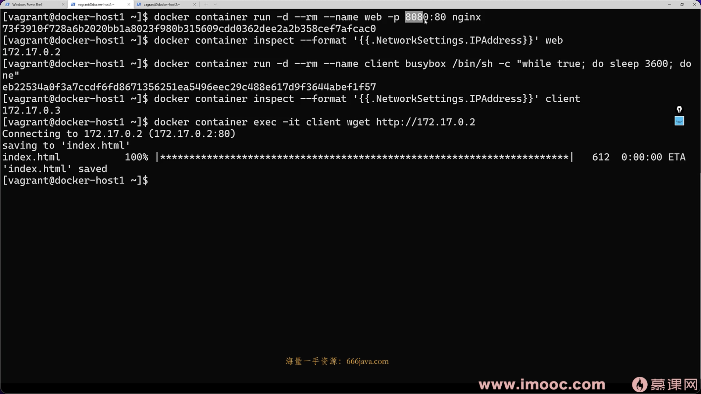

### 3.端口转发和dockerfile

dockerfile内部的 EXPOSE 的作用 其实是 告诉使用者 如何使用 并不是真正的 暴露端口

## 4.docker host网络

host network 和主机同享一个网络。使用host 网络启动nginx 性能会好一些

```powershell
docker container run -d --name web4 --network host nginx
```

查看容器日志

```
docker logs -f web5
```

## 5.linux网络命名空间

Linux的Namespace（命名空间）技术是一种隔离技术，常用的Namespace有 user namespace, process namespace, network namespace等

在Docker容器中，不同的容器通过Network namespace进行了隔离，也就是不同的容器有各自的IP地址，路由表等，互不影响。

Note

准备一台Linux机器，这一节会用到一个叫 `brtcl` 的命令，这个命令需要安装，如果是Ubuntu的系统，可以通过 `apt-get install bridge-utils` 安装；如果是Centos系统，可以通过 `sudo yum install bridge-utils` 来安装


### 创建bridge

```
[vagrant@docker-host1 ~]$ sudo brctl addbr mydocker0
[vagrant@docker-host1 ~]$ brctl show
bridge name     bridge id               STP enabled     interfaces
mydocker0               8000.000000000000       no
[vagrant@docker-host1 ~]$
```

### 准备一个shell脚本

Note

https://twitter.com/xiaopeng163/status/1531022226933391362?s=20&t=LuWDZHV3TCLmLsI1nCb1FQ

脚本名字叫 `add-ns-to-br.sh`

```
#!/bin/bash

bridge=$1
namespace=$2
addr=$3

vethA=veth-$namespace
vethB=eth00-$namespace

sudo ip netns add $namespace
sudo ip link add $vethA type veth peer name $vethB

sudo ip link set $vethB netns $namespace
sudo ip netns exec $namespace ip addr add $addr dev $vethB
sudo ip netns exec $namespace ip link set $vethB up

sudo ip link set $vethA up

sudo brctl addif $bridge $vethA
```

### 脚本执行

```
[vagrant@docker-host1 ~]$ sh add-ns-to-br.sh mydocker0 ns1 172.16.1.1/16
[vagrant@docker-host1 ~]$ sh add-ns-to-br.sh mydocker0 ns2 172.16.1.2/16
```

把mydocker0这个bridge up起来

```
[vagrant@docker-host1 ~]$ sudo ip link set dev mydocker0 up
```

### 验证

```
[vagrant@docker-host1 ~]$ sudo ip netns exec ns1 bash
[root@docker-host1 vagrant]# ip a
1: lo: <LOOPBACK> mtu 65536 qdisc noop state DOWN group default qlen 1000
    link/loopback 00:00:00:00:00:00 brd 00:00:00:00:00:00
5: eth00@if6: <BROADCAST,MULTICAST,UP,LOWER_UP> mtu 1500 qdisc noqueue state UP group default qlen 1000
    link/ether f2:59:19:34:73:70 brd ff:ff:ff:ff:ff:ff link-netnsid 0
    inet 172.16.1.1/16 scope global eth00
    valid_lft forever preferred_lft forever
    inet6 fe80::f059:19ff:fe34:7370/64 scope link
    valid_lft forever preferred_lft forever
[root@docker-host1 vagrant]# ping 172.16.1.2
PING 172.16.1.2 (172.16.1.2) 56(84) bytes of data.
64 bytes from 172.16.1.2: icmp_seq=1 ttl=64 time=0.029 ms
64 bytes from 172.16.1.2: icmp_seq=2 ttl=64 time=0.080 ms
^C
--- 172.16.1.2 ping statistics ---
2 packets transmitted, 2 received, 0% packet loss, time 1000ms
rtt min/avg/max/mdev = 0.029/0.054/0.080/0.026 ms
[root@docker-host1 vagrant]#
```

### 对外通信

https://www.karlrupp.net/en/computer/nat_tutorial

## 6.Python Flask + Redis 练习


### 程序准备

准备一个Python文件，名字为 `app.py` 内容如下：

```
from flask import Flask
from redis import Redis
import os
import socket

app = Flask(__name__)
redis = Redis(host=os.environ.get('REDIS_HOST', '127.0.0.1'), port=6379)


@app.route('/')
def hello():
    redis.incr('hits')
    return f"Hello Container World! I have been seen {redis.get('hits').decode('utf-8')} times and my hostname is {socket.gethostname()}.\n"
```

准备一个Dockerfile

```
FROM python:3.9.5-slim

RUN pip install flask redis && \
    groupadd -r flask && useradd -r -g flask flask && \
    mkdir /src && \
    chown -R flask:flask /src

USER flask

COPY app.py /src/app.py

WORKDIR /src

ENV FLASK_APP=app.py REDIS_HOST=redis

EXPOSE 5000

CMD ["flask", "run", "-h", "0.0.0.0"]
```

### 镜像准备

构建flask镜像，准备一个redis镜像。

```
$ docker image pull redis
$ docker image build -t flask-demo .
$ docker image ls
REPOSITORY   TAG          IMAGE ID       CREATED              SIZE
flask-demo   latest       4778411a24c5   About a minute ago   126MB
python       3.9.5-slim   c71955050276   8 days ago           115MB
redis        latest       08502081bff6   2 weeks ago          105MB
```

### 创建一个docker bridge

```
$ docker network create -d bridge demo-network
8005f4348c44ffe3cdcbbda165beea2b0cb520179d3745b24e8f9e05a3e6456d
$ docker network ls
NETWORK ID     NAME           DRIVER    SCOPE
2a464c0b8ec7   bridge         bridge    local
8005f4348c44   demo-network   bridge    local
80b63f711a37   host           host      local
fae746a75be1   none           null      local
$
```

### 创建redis container

创建一个叫 `redis-server` 的container，连到 demo-network上

```
$ docker container run -d --name redis-server --network demo-network redis
002800c265020310231d689e6fd35bc084a0fa015e8b0a3174aa2c5e29824c0e
$ docker container ls
CONTAINER ID   IMAGE     COMMAND                  CREATED         STATUS         PORTS      NAMES
002800c26502   redis     "docker-entrypoint.s…"   4 seconds ago   Up 3 seconds   6379/tcp   redis-server
$
```

### 创建flask container

```
$ docker container run -d --network demo-network --name flask-demo --env REDIS_HOST=redis-server -p 5000:5000 flask-demo
```

打开浏览器访问 [http://127.0.0.1:5000](http://127.0.0.1:5000/)

应该能看到类似下面的内容，每次刷新页面，计数加1

Hello Container World! I have been seen 36 times and my hostname is 925ecb8d111a.

### 总结

如果把上面的步骤合并到一起，成为一个部署脚本

```
# prepare image
docker image pull redis
docker image build -t flask-demo .

# create network
docker network create -d bridge demo-network

# create container
docker container run -d --name redis-server --network demo-network redis
docker container run -d --network demo-network --name flask-demo --env REDIS_HOST=redis-server -p 5000:5000 flask-demo
```
