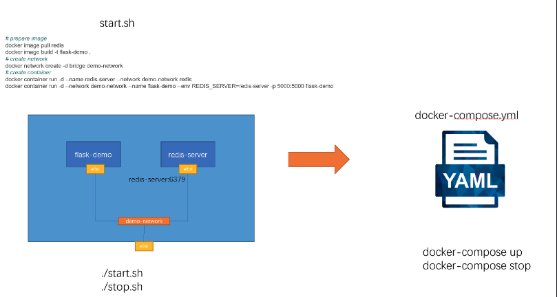

# Docker2

## 1.docker-compose

### 1.docker-compose介绍



### 2.docker-compose的安装

Windows和Mac在默认安装了docker desktop以后，docker-compose随之自动安装

```powershell
PS C:\Users\Peng Xiao\docker.tips> docker-compose --version
docker-compose version 1.29.2, build 5becea4c
```


Linux用户需要自行安装

最新版本号可以在这里查询 https://github.com/docker/compose/releases

```powershell
$ sudo curl -L "https://github.com/docker/compose/releases/download/1.29.2/docker-compose-$(uname -s)-$(uname -m)" -o /usr/local/bin/docker-compose
$ sudo chmod +x /usr/local/bin/docker-compose
$ docker-compose --version
docker-compose version 1.29.2, build 5becea4c
```


熟悉python的朋友，可以使用pip去安装docker-Compose

```powershell
$ pip install docker-compose
```


### 3.compose 文件的结构和版本

docker compose文件的语法说明 https://docs.docker.com/compose/compose-file/

#### 基本语法结构

```yml
version: "3.8"

services: # 容器
  servicename: # 服务名字，这个名字也是内部 bridge网络可以使用的 DNS name
    image: # 镜像的名字
    command: # 可选，如果设置，则会覆盖默认镜像里的 CMD命令
    environment: # 可选，相当于 docker run里的 --env
    volumes: # 可选，相当于docker run里的 -v
    networks: # 可选，相当于 docker run里的 --network
    ports: # 可选，相当于 docker run里的 -p
  servicename2:

volumes: # 可选，相当于 docker volume create

networks: # 可选，相当于 docker network create
```


以 Python Flask + Redis练习：为例子，改造成一个docker-compose文件

```sh
docker image pull redis
docker image build -t flask-demo .

# create network
docker network create -d bridge demo-network

# create container
docker container run -d --name redis-server --network demo-network redis
docker container run -d --network demo-network --name flask-demo --env REDIS_HOST=redis-server -p 5000:5000 flask-demo
```


docker-compose.yml 文件如下

```yml
version: "3.8"

services:
  flask-demo:
    image: flask-demo:latest
    environment:
      - REDIS_HOST=redis-server
    networks:
    - demo-network
    ports:
      - 8080:5000

  redis-server:
    image: redis:latest
    networks:
     - demo-network

networks:
  demo-network:
```


#### docker-compose 语法版本

向后兼容

https://docs.docker.com/compose/compose-file/

dockerfile 也可以指定

```yml
version: '3.8'

services:
  express-demo:
    build:
      context: ./server
      dockerfile: dockerfile.env
    image: express-demo-env
    entrypoint: -REDIS_HOST=redis-serever
    networks:
      - demo-network
    ports:
      - 3000:3000

networks:
  demo-network:

```

```powershell
docker-compose pull #可以提前拉镜像
```

```
docker-compose build
```

```
docker-compose up -d --build
```


### 4更新


### 5.水平拓展（负载均衡）

首先启动

```
docker-compose up -d --build
```

启动三组

```powershell
 docker-compose up -d --scale express-demo=3
```

