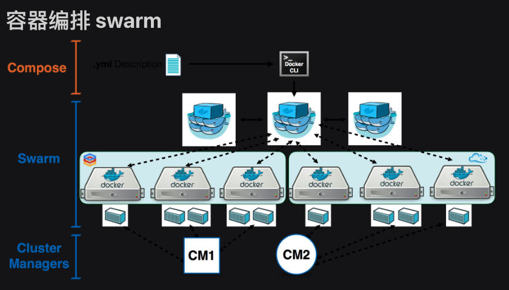

# Docker3

## 1.Docker Swarm

### 1.docker swarm简介

为什么不建议在生产环境中使用docker-Compose？

- 多机器如何管理？
- 如果跨机器做scale横向扩展？
- 容器失败退出时如何新建容器确保服务正常运行？
- 如何确保零宕机时间？
- 如何管理密码，Key等敏感数据？
- 其它



### 2.swarm单节点快速上手

```sh
$:docker info #查看是否激活swarm模式
Swarm: inactive
```

激活swarm，有两个方法：

初始化一个swarm集群，自己成为manager

加入一个已经存在的swarm集群

```sh
PS C:\Users\Peng Xiao\code-demo> docker swarm init
Swarm initialized: current node (vjtstrkxntsacyjtvl18hcbe4) is now a manager.

To add a worker to this swarm, run the following command:

 docker swarm join --token SWMTKN-1-46hoq89w0g033u3gx5aa6qta5mmsd6prc4gb03vmnktim2t0yv-a7u7ly6x142yaurkpolkie5c6 192.168.65.3:2377

To add a manager to this swarm, run 'docker swarm join-token manager' and follow the instructions.

PS C:\Users\Peng Xiao\code-demo> docker node ls
ID                            HOSTNAME         STATUS    AVAILABILITY   MANAGER STATUS   ENGINE VERSION
vjtstrkxntsacyjtvl18hcbe4 *   docker-desktop   Ready     Active         Leader           20.10.7
PS C:\Users\Peng Xiao\code-demo>
```

退出swarm环境 (--force强制离开)

```
docker swarm leave --force
```

创建一个server 可以理解为启动了一个容器

```
docker service create nginx:latest
```

启动三个nginx服务 然后 杀死一个 swarm 会帮我们启动一个

```sh
heyifan@heyifandeMacBook-Pro ~ % docker service ls
ID             NAME                    MODE         REPLICAS   IMAGE          PORTS
tgz6xf66u20u   xenodochial_engelbart   replicated   1/1        nginx:latest   

heyifan@heyifandeMacBook-Pro ~ % docker service ps tgz
ID             NAME                      IMAGE          NODE             DESIRED STATE   CURRENT STATE           ERROR     PORTS
yyf322kq9zyl   xenodochial_engelbart.1   nginx:latest   docker-desktop   Running         Running 4 minutes ago             
heyifan@heyifandeMacBook-Pro ~ % docker container ls
CONTAINER ID   IMAGE          COMMAND                  CREATED         STATUS         PORTS     NAMES
e8e0e56d8be9   nginx:latest   "/docker-entrypoint.…"   9 minutes ago   Up 9 minutes   80/tcp    xenodochial_engelbart.1.yyf322kq9zyl0uea663jtu6cu
heyifan@heyifandeMacBook-Pro ~ % docker service update tgz --replicas 3
tgz
overall progress: 3 out of 3 tasks 
1/3: running   [==================================================>] 
2/3: running   [==================================================>] 
3/3: running   [==================================================>] 
verify: Service converged 
heyifan@heyifandeMacBook-Pro ~ % docker service ls
ID             NAME                    MODE         REPLICAS   IMAGE          PORTS
tgz6xf66u20u   xenodochial_engelbart   replicated   3/3        nginx:latest  
heyifan@heyifandeMacBook-Pro ~ % docker service ps tgz                 
ID             NAME                      IMAGE          NODE             DESIRED STATE   CURRENT STATE            ERROR     PORTS
yyf322kq9zyl   xenodochial_engelbart.1   nginx:latest   docker-desktop   Running         Running 14 minutes ago             
nv4lz1f8dr7i   xenodochial_engelbart.2   nginx:latest   docker-desktop   Running         Running 34 seconds ago             
y4v6tcjazczv   xenodochial_engelbart.3   nginx:latest   docker-desktop   Running         Running 34 seconds ago     
heyifan@heyifandeMacBook-Pro ~ % docker container ls                   
CONTAINER ID   IMAGE          COMMAND                  CREATED          STATUS          PORTS     NAMES
29d62541c5a2   nginx:latest   "/docker-entrypoint.…"   49 seconds ago   Up 48 seconds   80/tcp    xenodochial_engelbart.2.nv4lz1f8dr7imd7rz06bnj8se
736bd34ec264   nginx:latest   "/docker-entrypoint.…"   49 seconds ago   Up 48 seconds   80/tcp    xenodochial_engelbart.3.y4v6tcjazczvthjiw65mzowwi
e8e0e56d8be9   nginx:latest   "/docker-entrypoint.…"   15 minutes ago   Up 15 minutes   80/tcp    xenodochial_engelbart.1.yyf322kq9zyl0uea663jtu6cu

heyifan@heyifandeMacBook-Pro ~ % docker container rm -f e8
e8
heyifan@heyifandeMacBook-Pro ~ % docker service ps tgz    
ID             NAME                          IMAGE          NODE             DESIRED STATE   CURRENT STATE                     ERROR                         PORTS
nl7q05qzfpj9   xenodochial_engelbart.1       nginx:latest   docker-desktop   Running         Starting less than a second ago                                 
yyf322kq9zyl    \_ xenodochial_engelbart.1   nginx:latest   docker-desktop   Shutdown        Failed 5 seconds ago              "task: non-zero exit (137)"   
nv4lz1f8dr7i   xenodochial_engelbart.2       nginx:latest   docker-desktop   Running         Running 5 minutes ago                                           
y4v6tcjazczv   xenodochial_engelbart.3       nginx:latest   docker-desktop   Running         Running 5 minutes ago                                           
heyifan@heyifandeMacBook-Pro ~ % 
```

停止 service 

```powershell
heyifan@heyifandeMacBook-Pro ~ % docker service rm tgz6xf66u20u
tgz6xf66u20u
```

### 3.Swarm三节点集群搭建

创建3节点swarm cluster的方法

- https://labs.play-with-docker.com/ play with docker 网站， 优点是快速方便，缺点是环境不持久，4个小时后环境会被重置
- 在本地通过虚拟化软件搭建Linux虚拟机，优点是稳定，方便，缺点是占用系统资源，需要电脑内存最好8G及其以上
- 在云上使用云主机， 亚马逊，Google，微软Azure，阿里云，腾讯云等，缺点是需要消耗金钱（但是有些云服务，有免费试用）

多节点的环境涉及到机器之间的通信需求，所以防火墙和网络安全策略组是大家一定要考虑的问题，特别是在云上使用云主机的情况，下面这些端口记得打开 `防火墙` 以及 `设置安全策略组`

- TCP port `2376`
- TCP port `2377`
- TCP and UDP port `7946`
- UDP port `4789`

为了简化，以上所有端口都允许节点之间自由访问就行。

使用vm搭建三个linux虚拟机

1、首先选择桥接网络 

2、下载ifconfig 

3、查看ip

4、使用nxshell链接三个虚拟机

5、安装docker环境

6、启动一个swarm

7、关闭leander的防火墙

```sh
systemctl stop firewalld.service
systemctl disable firewalld.service #永久停止
```

然后分别在其他两台机器上执行

```powershell
[root@localhost ~]# docker swarm join --token SWMTKN-1-09f9e55ojwu9gdwyo6bc745a6cyuueboc5ruhmgwef7soo6d1q-5molycdj14ke2hp2jbangwg9n 192.168.1.140:2377
This node joined a swarm as a worker.
```

切换到leader上 查看docker node ls

```powershell
[root@localhost ~]# docker node ls
ID                            HOSTNAME                STATUS              AVAILABILITY        MANAGER STATUS
ddxdxepdr47qbj0rndzvn9gf0     localhost.localdomain   Ready               Active              
knwim9l05n8b791ibyohncxxf     localhost.localdomain   Ready               Active              
qn7d60evrbw2d0943vfglpcv4 *   localhost.localdomain   Ready               Active              Leader
```

然后在leader上执行

```powershell
[root@localhost ~]# docker image pull nginx
Using default tag: latest
latest: Pulling from library/nginx
a603fa5e3b41: Pull complete 
c39e1cda007e: Pull complete 
90cfefba34d7: Pull complete 
a38226fb7aba: Pull complete 
62583498bae6: Pull complete 
9802a2cfdb8d: Pull complete 
Digest: sha256:e209ac2f37c70c1e0e9873a5f7231e91dcd83fdf1178d8ed36c2ec09974210ba
Status: Downloaded newer image for nginx:latest
[root@localhost ~]# docker image ls
REPOSITORY          TAG                 IMAGE ID            CREATED             SIZE
nginx               latest              88736fe82739        13 days ago         142MB
[root@localhost ~]# docker service create --name web2 nginx
```

开启三个service

```powershell
[root@localhost ~]# docker service update web2 --replicas 3
web2
overall progress: 3 out of 3 tasks 
1/3: running   [==================================================>] 
2/3: running   [==================================================>] 
3/3: running   [==================================================>] 
verify: Service converged 
[root@localhost ~]# docker service ls
ID                  NAME                MODE                REPLICAS            IMAGE               PORTS
lifmeuezkql0        web                 replicated          0/1                 niginx:latest       
nq6ob542gv6d        web2                replicated          3/3                 nginx:latest        
```

docker service scale web2=4  

也可以启动多个 或者

docker service scale web2=1

停止三个

```shll
docker service logs web2
```

查看日志所有的

```shll
docker service logs web2 -
```

一直监听 通过ctrl+c退出

### 4.Swarm的网络

对于理解swarm的网络来讲，个人认为最重要的两个点：

* 第一是外部如何访问部署运行在swarm集群内的服务，可以称之为 `入方向` 流量，在swarm里我们通过 `ingress` 来解决

* 第二是部署在swarm集群里的服务，如何对外进行访问，这部分又分为两块:
  
  * 第一，`东西向流量` ，也就是不同swarm节点上的容器之间如何通信，swarm通过 `overlay` 网络来解决；
  
  * 第二，`南北向流量` ，也就是swarm集群里的容器如何对外访问，比如互联网，这个是 `Linux bridge + iptables NAT` 来解决的
    
    

#### 1、overlay网络

```shell
[root@localhost ~]# docker network create -d overlay mynet
kd0yhmrmnezgaykr4tcghum4o
[root@localhost ~]# docker network ls
NETWORK ID          NAME                DRIVER              SCOPE
05a656ac44be        bridge              bridge              local
2653916be8cb        docker_gwbridge     bridge              local
025a21e2a00e        host                host                local
k99bs6672geq        ingress             overlay             swarm
kd0yhmrmnezg        mynet               overlay             swarm
30cf2123cc26        none  
```

```shell
docker service create --network mynet --name test busybox ping 8.8.8.8
#创建service的时候可以指定网络
docker service create --network mynet --name test --replicas 2 busybox ping 8.8.8.8
#创建service的时候可以指定网络并且指定初始化replicas的数量
```

2、ingress网络


