# Redis7


```bash
redis-cli -a -p6379
```
## redis10大数据类型

### String(字符串)


### Bitmap(位图)


### Bitfield（位域）


### Hash（哈希表）


### List（列表）


### Set（集合）


### SortedSet（ZSet有序集合）


### Geospatial（GEO地理空间）


### Hyperlog（基数统计）


### Stream（流）


### 哪里去获得Redis常见数据类型的操作命令呢

```
英文网址 https://redis.io/commands/
中文 http://www.redis.cn/commands.html
```

### 常用操作命令

```bash
keys *  #查看当前库所有的key
exists key  #判断某个key是否存在
type key #查看你的key是什么类型
del key #删除指定的key数据
unlink key #非阻塞删除 仅仅将keys从keyspace元数据中删除 真正的删除会在后续一步中操作
ttl key #查看还有多少秒国旗 -1表示永不过期 -2表示已过期
expire key #秒钟 给定的key设置过期时间
move kye dbindex【0-15】#将当前数据库的key移动到给定的数据库db 当中
select dbindex #切换数据库0-15 默认0
dbsize #查看当前数据库key的数量
flushdb #清空当前库
flushall #通杀全部苦
```

### 数据类型命令以及落地运用

#### 字符串String

##### 应用场景

```
比如抖音无线点赞某个视频或者商品 点一下加一次
是否喜欢的文章
```

##### 常用

```
从2.6.12版本开始，redis为SET命令增加了一系列选项:

EX seconds – Set the specifie`d expire time, in seconds.
PX milliseconds – Set the specified expire time, in milliseconds.
NX – Only set the key if it does not already exist.
XX – Only set the key if it already exist.

EX seconds – 设置键key的过期时间，单位时秒
PX milliseconds – 设置键key的过期时间，单位时毫秒
NX – 只有键key不存在的时候才会设置key的值
XX – 只有键key存在的时候才会设置key的值
注意: 由于SET命令加上选项已经可以完全取代SETNX, SETEX, PSETEX的功能，所以在将来的版本中，redis可能会不推荐使用并且最终抛弃这几个命令。

返回值
simple-string-reply:如果SET命令正常执行那么回返回OK，否则如果加了NX 或者 XX选项，但是没有设置条件。那么会返回nil。

```

##### 同时设置/获取多个键值

```bash
mset ket value [key value .....]
mget key [key ...]
mest/mget/msetnx
```

##### 获取指定区间范围内的值

```
getrange/setrange
```

##### 数值增减

```
递增数字 incr k1
增加指定的整数 incrby key 30
递减数值 cecr key 
减少指定的整数 decrby key 30
```

##### 获取字符串长度追加

```
set k1 abcd 
获取长度 strlen k1
追加 append k1 xxxx
```

##### 分布式锁

```
setnx lock uuid
setex k1 50 v1
```

##### getset 先get再set

```
getset k1 v111
```


#### 列表List

##### 应用场景

```
微信公众号订阅的消息
```

##### 常用命令

```bash
lpush l1 1 2 3 4 5 #从左推入
rpush l1 6 7 #从右推入
lrange l1 0 -1 #遍历输出
#rpush 与 lrange 同时使用 怎么用的怎么输出
lpop #从左侧弹出（删除）一个
rpop #从右边弹出（删除）一个
lindex l1 0 #按照下标取对应的value
llen l1 #获取list长度
lrem l2 2 1 #在l2中删除两个1
ltrim key 开始index 结束index  #截取指定范围的值后再赋值给key
rpoplpush l1 l2 #从l1中弹出最右侧value 到 l2最左侧value中
lset key index value
linsert key before/after #已有值 插入的新值
```


#### 哈希Hash

##### 常用命令

```bash
hset/hget/hmset/hmget/hgetall/hdel
hlen
hexists key 在key里面的某个值的key #判断某个key是否存在中
hkeys/hvals #获取key/value
hincrby/hincrbyfloat #对number/float类型的数据累加
hsetnx #不存在赋值 存在 无效
```


```bash
127.0.0.1:6379> hset user:001 id 11 name zs age 25
(integer) 3
127.0.0.1:6379>  hgetall user:001
1) "id"
2) "11"
3) "name"
4) "zs"
5) "age"
6) "25"
127.0.0.1:6379> hget user:001 name
"zs"
127.0.0.1:6379> hmset user:002 id 22 name ls age 26
OK
127.0.0.1:6379> hmget user:002 id name
127.0.0.1:6379> hdel user:002 name
(integer) 1
127.0.0.1:6379> hgetall user:002
1) "id"
2) "22"
3) "age"
4) "26"
127.0.0.1:6379> hlen user:002
(integer) 2

127.0.0.1:6379> hexists user:002 id
(integer) 1
127.0.0.1:6379> hexists user:002 name
(integer) 0

127.0.0.1:6379> hkeys user:002
1) "id"
2) "age"
127.0.0.1:6379> hvals user:002
1) "22"
2) "26"

127.0.0.1:6379> hincrby user:002 id 1
(integer) 23
127.0.0.1:6379> hincrbyfloat user:002 c 0.5
"89"

127.0.0.1:6379> hsetnx user:002 emal 329873@qq.com
(integer) 1
127.0.0.1:6379> hsetnx user:002 emal 329873@qq.com
(integer) 0
```


##### 应用场景

JD早期购物车


#### 集合Set

##### 常用命令

```bash
sadd key member [member....]  #添加元素 
smembers key #遍历集合中所有元素
sismember key member #判断元素是否在集合中
srem key member [member ...] #删除元素
scard #获取集合里面的元素个数
srandmember key [数字]  #从集合中随机展现设置的数字个数元素，元素不删除
spop key[数字] #从集合中随机弹出一个元素 出一个删一个
smove key1 key2 #在key1里已存在的某个值 将key1里已存在的某个值赋值给key2

```


```bash
127.0.0.1:6379> sadd s1 1 1 1 1 2 2 2 3 4 5
(integer) 5
127.0.0.1:6379> smembers s1
1) "1"
2) "2"
3) "3"
4) "4"
5) "5"
127.0.0.1:6379> sismember s1 7
(integer) 0
127.0.0.1:6379> sismember s1 1
(integer) 1
127.0.0.1:6379> srem s1 0
(integer) 0
127.0.0.1:6379> srem s1 1
(integer) 1
127.0.0.1:6379> smembers s1
1) "2"
2) "3"
3) "4"
4) "5"
127.0.0.1:6379> scard s1
(integer) 4
127.0.0.1:6379> SRANDMEMBER s1 2
1) "4"
2) "5"
127.0.0.1:6379> SMEMBERS s1
1) "2"
2) "3"
3) "4"
4) "5"
127.0.0.1:6379> spop s1
"5"
127.0.0.1:6379> spop s1 2
1) "4"
2) "3"
127.0.0.1:6379> SMEMBERS s1
1) "2"
127.0.0.1:6379> sadd s2 a b c d 
(integer) 4
127.0.0.1:6379> smove s1 s2 2
(integer) 1
127.0.0.1:6379> SMEMBERS s2
1) "c"
2) "b"
3) "d"
4) "a"
5) "2"
```

集合运算

```
s1: a b c 1 2
s2: 1 2 3 a x
集合的差集运算a-b :SDIFF s1 s2
集合的并集运算a U b:SUNION s1 s2
集合的交集运算a ∩ b: SINTER s1 s2
```


```bash
127.0.0.1:6379> SDIFF s1 s2
1) "b"
2) "c
127.0.0.1:6379> SDIFF s2 s1
1) "3"
2) "x"
127.0.0.1:6379> SUNION s1 s2
1) "c"
2) "1"
3) "a"
4) "x"
5) "2"
6) "b"
7) "3"
127.0.0.1:6379> SINTER s1 s2
1) "1"
2) "a"
3) "2"
127.0.0.1:6379> SINTERCARD 2 s1 s2
(integer) 3
127.0.0.1:6379> SINTERCARD 2 s1 s2 limit 2
(integer) 2
127.0.0.1:6379> SINTERCARD 2 s1 s2 limit 1
(integer) 1
127.0.0.1:6379> SINTERCARD 2 s1 s2 limit 4
(integer) 3
```

##### 使用场景

```bash
微信抽奖小程序
微信朋友圈点赞查看同赞朋友
QQ内推可能认识的人 #SDIFF s1 s2
```


#### 有序集合Zset(sorted set)

##### 常用命令

```bash
127.0.0.1:6379> ZADD zs1 60 v1 70 v2 80 v3 90 v4
(integer) 4
127.0.0.1:6379> ZRANGE zs1 0 -1 #输出value
1) "v1"
2) "v2"
3) "v3"
4) "v4"
127.0.0.1:6379> ZRANGE zs1 0 -1 withscores #带分数输出（顺序）从小到大
1) "v1"
2) "60"
3) "v2"
4) "70"
5) "v3"
6) "80"
7) "v4"
8) "90"
127.0.0.1:6379> ZREVRANGE zs1 0 -1 withscores #带分数输出（倒叙） 从大到小
1) "v4"
2) "90"
3) "v3"
4) "80"
5) "v2"
6) "70"
7) "v1"
8) "60"
127.0.0.1:6379> ZRANGEBYSCORE zs1 60 90  #选出其中60--90分的
1) "v1"
2) "v2"
3) "v3"
4) "v4"
127.0.0.1:6379> ZRANGEBYSCORE zs1 60 90  withscores #选出其中60--90分的 带分数
1) "v1"
2) "60"
3) "v2"
4) "70"
5) "v3"
6) "80"
7) "v4"
8) "90"
127.0.0.1:6379> ZRANGEBYSCORE zs1 (60 90  withscores  #选出其中60--90分的 带分数 不包含60
1) "v2"
2) "70"
3) "v3"
4) "80"
5) "v4"
6) "90"
127.0.0.1:6379> ZRANGEBYSCORE zs1 (60 90  withscores limit 0 1 #限制次数
1) "v2"
2) "70"
127.0.0.1:6379> ZREM zs1 v4 #删除一个zset
(integer) 1
127.0.0.1:6379> ZINCRBY zs1 3 v1 #增加某个元素的分数
"63"
127.0.0.1:6379> ZCOUNT zs1 60 90 #获得指定分数范围内的元素个数
(integer) 3
127.0.0.1:6379> ZMPOP 1 zs1 min count 1 #从键名列表中的第一个非空排序集中弹出一个或者多个元素 他们是成员分数对
1) "zs1"
2) 1) 1) "v1"
      2) "63"
127.0.0.1:6379> zrank zs1 v3 #获取对应的下标
(integer) 0
127.0.0.1:6379> ZREVRANK zs1 v3 #获取对应的逆序下标
(integer) 0
```

##### 应用场景

```
根据商品销售对商品进行排序显示
热销的主播
打赏榜1-5
```


#### 位图bitmap p21集

##### 常用命令


##### 应用场景

```
一年365天 全年天天登录占用多少字节
```


#### 基数统计HyperLogLog

##### 常用命令

```bash
127.0.0.1:6379> pfadd h1 1 2 3 4 4 5 6 6 7
(integer) 1
127.0.0.1:6379> pfadd h2 2 3 4 4 4 5 6 6
(integer) 1
127.0.0.1:6379> pfcount h1
(integer) 7
127.0.0.1:6379> pfcount h2
(integer) 5
127.0.0.1:6379> PFMERGE distResult h1 h2 #合并h1、h2 为新的hyperloglog distResult 合并后原 h1 h2 仍然保留
OK
127.0.0.1:6379> pfcount distResult
(integer) 7
```

##### 应用场景

```
天猫网站首页 亿级 pv uv的统计（见高级篇）
```


#### 地理空间GEO

##### 常用命令

```
GEOADD 多个经度（longitude）、纬度（latitude）位置名称（member）添加到指定的key中
GEOPOS从键里面返回所有给定位置元素的位置（经度和纬度）
GEODIST 返回两个给定位置之间的距离
GEORADIUS 以给定的经纬度为中心 返回与中心的距离不超过给定最大距离的所有位置元素
GEORADIUSBYMEMBER跟GEORADIUS类似
GEOHASH返回一个或多个位置元素的Geohash表示
```


```bash
127.0.0.1:6379> geoadd city 121.497606 31.246303 "wtgj" 121.498971 31.231374 "chm" 121.489413 31.235882 "fzgy"
127.0.0.1:6379> ZRANGE city 0 -1
1) "fzgy"
2) "chm"
3) "wtgj"
127.0.0.1:6379> GEOPOS city wtgj chm fzgy
1) 1) "121.49760693311691284"
   2) "31.24630236625470303"
2) 1) "121.49896949529647827"
   2) "31.2313728586261945"
3) 1) "121.48941546678543091"
   2) "31.23588212756866511"
127.0.0.1:6379> GEOHASH city wtgj chm fzgy #对经纬度做哈希映射
1) "wtw3u8pygk0"
2) "wtw3sv2zgj0"
3) "wtw3sw3fhw0" 
127.0.0.1:6379> geodist city wtgj chm km #两个位置之间的距离 km/m
"1.6656"
127.0.0.1:6379> GEORADIUS city 121.493724 31.233149 10 km withdist withcoord withhash count 10 desc
1) 1) "wtgj" #地址名称
   2) "1.5089" #距离
   3) (integer) 4054803519628171 #hash
   4) 1) "121.49760693311691284" #经度
      2) "31.24630236625470303"#纬度
2) 1) "chm"
   2) "0.5366"
   3) (integer) 4054803504489175
   4) 1) "121.49896949529647827"
      2) "31.2313728586261945"
3) 1) "fzgy"
   2) "0.5102"
   3) (integer) 4054803500230692
   4) 1) "121.48941546678543091"
      2) "31.23588212756866511"
```

##### 应用场景

```
附近的位置
```

#### 流Stream


##### 常用命令

生产者指令


消费者指令


特殊符号


```bash
127.0.0.1:6379> xadd mystream * id 11 cname z3
"1678086739139-0"
127.0.0.1:6379> xadd mystream * id 12 cname l4
"1678086753139-0"
127.0.0.1:6379> xrange mystream - +  #查看
1) 1) "1678086739139-0"
   2) 1) "id"
      2) "11"
      3) "cname"
      4) "z3"
2) 1) "1678086753139-0"
   2) 1) "id"
      2) "12"
      3) "cname"
      4) "l4"
      
1) 1) "1678086739139-0"  #查看一条
   2) 1) "id"
      2) "11"
      3) "cname"
      4) "z3"
      
127.0.0.1:6379> XREVRANGE mystream + 1 #反转输出
1) 1) "1678086753139-0"
   2) 1) "id"
      2) "12"
      3) "cname"
      4) "l4"
2) 1) "1678086739139-0"
   2) 1) "id"
      2) "11"
      3) "cname"
      4) "z3"
127.0.0.1:6379> XDEL mystream 1678086753139-0 #删除一个
(integer) 1
127.0.0.1:6379> XLEN mystream  #查看有几条记录
(integer) 1

127.0.0.1:6379> xread count 2 streams mystream $ # $表示特殊id 表示以当前stream一句存储的最大的id作为最后一个id 当前stream中不存在大于当前最大id的消息 因此此时返回nil 
(nil)
127.0.0.1:6379> xread count 2 streams mystream 0-0 #0-0 表示从最小的id开始获取stream中的消息 当不指定count 将会返回stream中所有消息 注意也可以使用 0 （00/000也都是可以的）
1) 1) "mystream"
   2) 1) 1) "1678086739139-0"
         2) 1) "id"
            2) "11"
            3) "cname"
            4) "z3"
      2) 1) "1678087645970-0"
         2) 1) "k1"
            2) "v1"
            3) "k2"
            4) "v2"

```


阻塞


```bash
127.0.0.1:6379> XREADGROUP GROUP groupX consumer1 STREAMS mystream >
1) 1) "mystream"
   2) 1) 1) "1678086739139-0"
         2) 1) "id"
            2) "11"
            3) "cname"
            4) "z3"
      2) 1) "1678087645970-0"
         2) 1) "k1"
            2) "v1"
            3) "k2"
            4) "v2"
      3) 1) "1678087654700-0"
         2) 1) "k3"
            2) "v3"
            3) "k4"
            4) "v4"
      4) 1) "1678087666183-0"
         2) 1) "k5"
            2) "v5"
            3) "k6"
            4) "v6"
127.0.0.1:6379> XREADGROUP GROUP groupX consumer2 STREAMS mystream >
(nil)
#stream中的消息一旦被消费组里的一个消费者读取了 就不能再被该消费组中其他消费者读取了 即 同一个消费组里 的消费者不能消费同一条消息 刚才的xreadgroup命令 再执行一次 此时读到的就是空值

#查看未签收的
127.0.0.1:6379> XPENDING mystream groupX
1) (integer) 4
2) "1678086739139-0" #所有消费者读取的消息最小Id
3) "1678087666183-0" #所有消费者读取的消息最大id
4) 1) 1) "consumer1"
      2) "4" #一口气读了四条

#查看 消费组A中的消费者1 消费了哪些信息

127.0.0.1:6379> XPENDING mystream groupX - + 10 consumer1
1) 1) "1678086739139-0"
   2) "consumer1"
   3) (integer) 780666
   4) (integer) 1
2) 1) "1678087645970-0"
   2) "consumer1"
   3) (integer) 780666
   4) (integer) 1
3) 1) "1678087654700-0"
   2) "consumer1"
   3) (integer) 780666
   4) (integer) 1
4) 1) "1678087666183-0"
   2) "consumer1"
   3) (integer) 780666
   4) (integer) 1


127.0.0.1:6379> XACK mystream groupX 1678086739139-0 #签收第一条
(integer) 1
```


```
$表示从Stream尾部开始消费
0表示从Stream头部开始消费
创建消费者组的时候必须制定ID，ID为0表示从头开始消费 为$表示只消费新的消息 队尾新来
```

消费组的目的：

让组内的多个消费者 共同分担读取消息 所以 我们通常会让 每一个消费者读取部分消息  从而实现消息读取 负载在多个消费者间是均衡分布的

使用建议 

stream还是不能百分之百等价于kafaka rabbitmq来使用的 生产案例少 慎用


#### 位域bitfield p27

了解即可


## Redis持久化

### RDB（Redis DataBase快照打包型）

RDB：持久性以指定时间间隔执行数据集的时间点快照

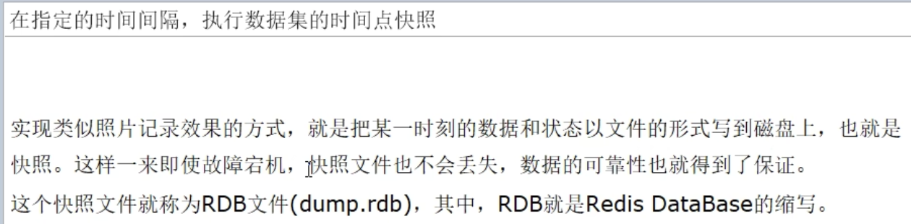


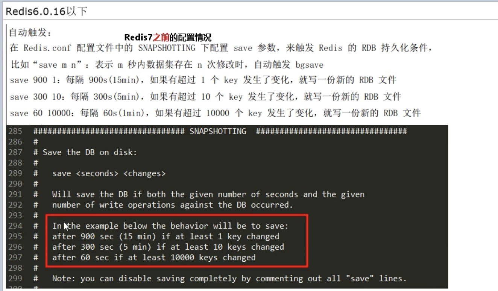


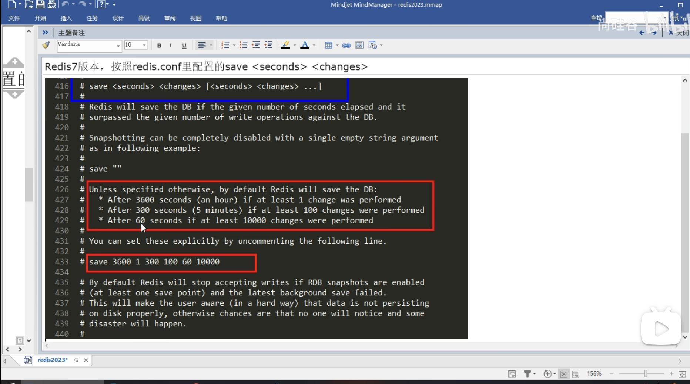


修改完文件后 要重启redis

如何恢复

注意：执行flushall/flushdb命令也会产生dump.rdb文件 但是里面是空的 毫无意义  

shutdown也会产生一个新的dump.rdb文件

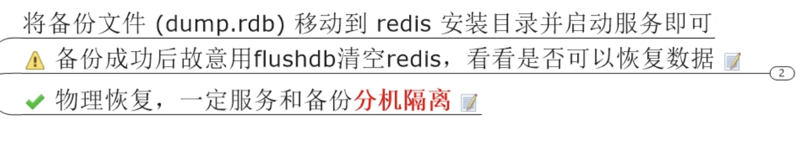

手动保存：

生产环境使用 bgsave（非阻塞）

save（阻塞） 不用

优点：


缺点：

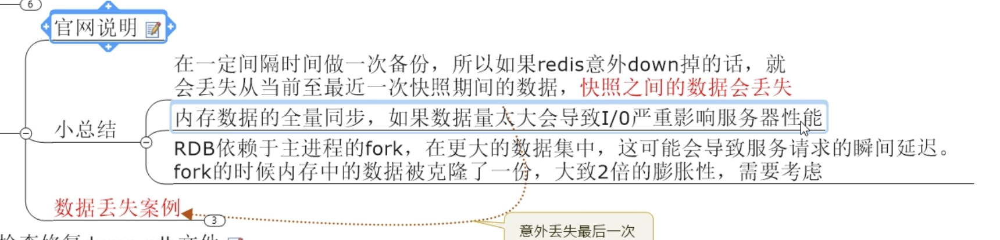

检查并且修复rdb文件


```bash
cd usr/lock/bin  #进入redis的安装目录
redis -check-rdb /myredis/dumpfiles/dump6379.rdb
```

哪些操作会出发生成rdb文件

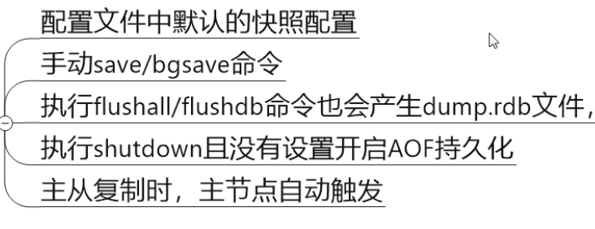

如何禁用快照：

1、修改配置文件 

```bash
save ""
```

2、动态所有停止RDB保存规则的方法

```bash
redis-cli config set save ""
```

rdb参数优化

```bash
stop-writes-no-bgsave-error yes 
# 如果配置成no 表示你不在乎数据不一致或者有其他的手段发现和控制这种不一致 那么在快照写入失败时 ，也能确保redis继续接受新的写请求
rdbcompression yes
#默认 yes 对于存储到磁盘中的快照 可以设置是否进行压缩存储 如果是的话 redis会采用lzf算法进行压缩 如果是你不想消耗cpu来进行压缩的话 可以设置为关闭此功能
rdbchecksum yes
#默认yes 在存储快照后 还可以让redis使用CRC64算法来进行数据校验 但是这样做会增加大约10%的性能消耗 如果希望获取到最大的性能提升 可以关闭此功能
rdb-del-sync-files no 
#在没有持久性的情况下 删除 复制中使用的rdb文件启用 默认情况下no 此选项是禁用的
```


### AOF（Append Only File） 记录命令型

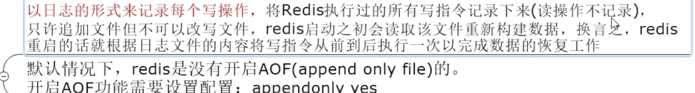

保 存的文件叫做 appendonly.aof 

AOF持久化工作流程

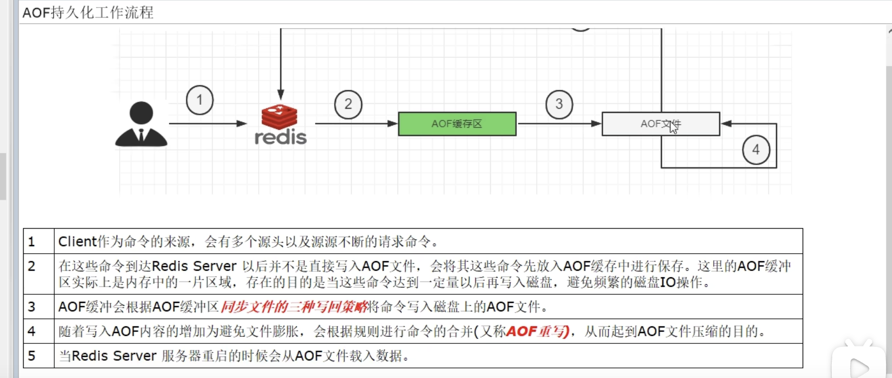


写回策略：

```
always 同步写回 每个写命令执行完毕立刻同步的将日志写回磁盘
everysec 每秒写回 每个写命令执行完毕后 只是先把日志写到aof文件的内存缓冲区 每隔1秒 把缓冲区中的 内容写入磁盘
no 操作系统控制的写回 每个写命令执行完 只是先把日志写到aof文件的内存缓冲区 由操作系统决定何时将缓冲区内容写回磁盘
```

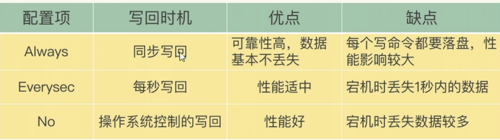

如何开启aof

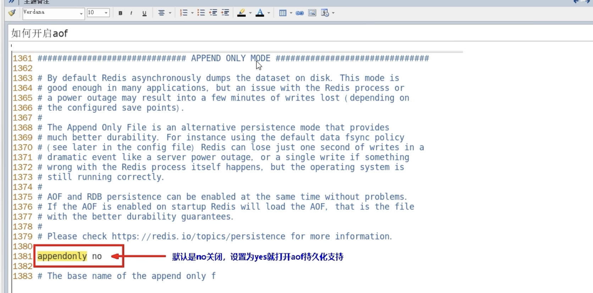


aof文件-保存路径

reids6:


Redis7:

conf文件 1414行

```bash
appenddirname "appendonlydir"
```

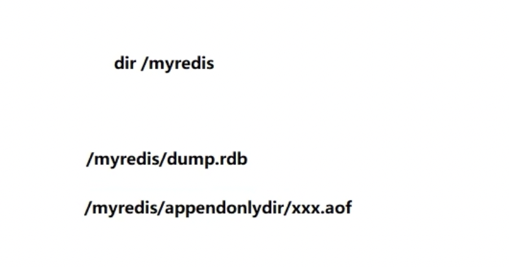

aof保存的名称

Redis6:有且只有一个

Redis7:

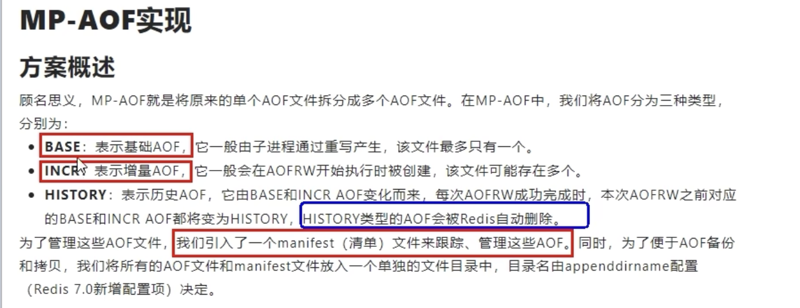


如何恢复

1.正常恢复：

重启redis 然后重新加载 结果ok

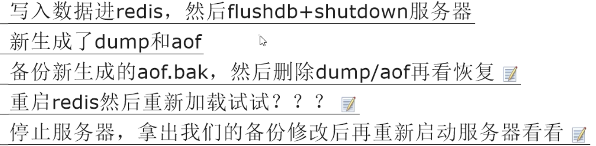

2.异常恢复

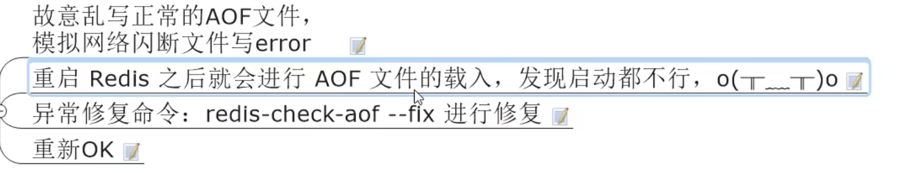

```bash
redis-check-aof --fix /myredis/appendonlydir/appendonly.aof.1.incr.aof
```

优势:

- 使用AOF Redis会更具有可持久性(durable)：你可以有很多不同的fsync策略：没有fsync，每秒fsync，每次请求时fsync。使用默认的每秒fsync策略，写性能也仍然很不错(fsync是由后台线程完成的，主线程继续努力地执行写请求)，即便你也就仅仅只损失一秒钟的写数据。
- AOF日志是一个追加文件，所以不需要定位，在断电时也没有损坏问题。即使由于某种原因文件末尾是一个写到一半的命令(磁盘满或者其他原因),redis-check-aof工具也可以很轻易的修复。
- 当AOF文件变得很大时，Redis会自动在后台进行重写。重写是绝对安全的，因为Redis继续往旧的文件中追加，使用创建当前数据集所需的最小操作集合来创建一个全新的文件，一旦第二个文件创建完毕，Redis就会切换这两个文件，并开始往新文件追加。
- AOF文件里面包含一个接一个的操作，以易于理解和解析的格式存储。你也可以轻易的导出一个AOF文件。例如，即使你不小心错误地使用FLUSHALL命令清空一切，如果此时并没有执行重写，你仍然可以保存你的数据集，你只要停止服务器，删除最后一条命令，然后重启Redis就可以。

劣势：

- 对同样的数据集，AOF文件通常要大于等价的RDB文件。
- AOF可能比RDB慢，这取决于准确的fsync策略。通常fsync设置为每秒一次的话性能仍然很高，如果关闭fsync，即使在很高的负载下也和RDB一样的快。不过，即使在很大的写负载情况下，RDB还是能提供能好的最大延迟保证。
- 在过去，我们经历了一些针对特殊命令(例如，像BRPOPLPUSH这样的阻塞命令)的罕见bug，导致在数据加载时无法恢复到保存时的样子。这些bug很罕见，我们也在测试套件中进行了测试，自动随机创造复杂的数据集，然后加载它们以检查一切是否正常，但是，这类bug几乎不可能出现在RDB持久化中。为了说得更清楚一点：Redis AOF是通过递增地更新一个已经存在的状态，像MySQL或者MongoDB一样，而RDB快照是一次又一次地从头开始创造一切，概念上更健壮。但是，1)要注意Redis每次重写AOF时都是以当前数据集中的真实数据从头开始，相对于一直追加的AOF文件(或者一次重写读取老的AOF文件而不是读内存中的数据)对bug的免疫力更强。2)我们还没有收到一份用户在真实世界中检测到崩溃的报告。


### RDB-AOP混合持久化


### 纯缓存模式