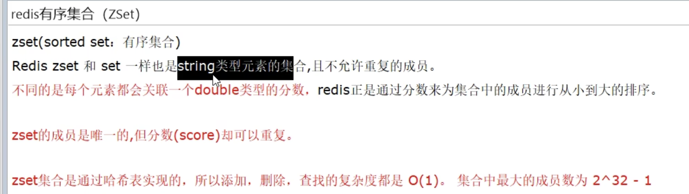

# Redis7

```bash
redis-cli -a -p6379
```
## redis10大数据类型

### String(字符串)


### Bitmap(位图)


### Bitfield（位域）


### Hash（哈希表）


### List（列表）


### Set（集合）


### SortedSet（ZSet有序集合）



### Geospatial（GEO地理空间）


### Hyperlog（基数统计）


### Stream（流）


### 哪里去获得Redis常见数据类型的操作命令呢

```
英文网址 https://redis.io/commands/
中文 http://www.redis.cn/commands.html
```

### 常用操作命令

```bash
keys *  #查看当前库所有的key
exists key  #判断某个key是否存在
type key #查看你的key是什么类型
del key #删除指定的key数据
unlink key #非阻塞删除 仅仅将keys从keyspace元数据中删除 真正的删除会在后续一步中操作
ttl key #查看还有多少秒国旗 -1表示永不过期 -2表示已过期
expire key #秒钟 给定的key设置过期时间
move kye dbindex【0-15】#将当前数据库的key移动到给定的数据库db 当中
select dbindex #切换数据库0-15 默认0
dbsize #查看当前数据库key的数量
flushdb #清空当前库
flushall #通杀全部苦
```

### 数据类型命令以及落地运用

#### 字符串string

##### 应用场景

```
比如抖音无线点赞某个视频或者商品 点一下加一次
是否喜欢的文章
```

##### 常用

```
从2.6.12版本开始，redis为SET命令增加了一系列选项:

EX seconds – Set the specifie`d expire time, in seconds.
PX milliseconds – Set the specified expire time, in milliseconds.
NX – Only set the key if it does not already exist.
XX – Only set the key if it already exist.

EX seconds – 设置键key的过期时间，单位时秒
PX milliseconds – 设置键key的过期时间，单位时毫秒
NX – 只有键key不存在的时候才会设置key的值
XX – 只有键key存在的时候才会设置key的值
注意: 由于SET命令加上选项已经可以完全取代SETNX, SETEX, PSETEX的功能，所以在将来的版本中，redis可能会不推荐使用并且最终抛弃这几个命令。

返回值
simple-string-reply:如果SET命令正常执行那么回返回OK，否则如果加了NX 或者 XX选项，但是没有设置条件。那么会返回nil。

```

##### 同时设置/获取多个键值

```bash
mset ket value [key value .....]
mget key [key ...]
mest/mget/msetnx
```

##### 获取指定区间范围内的值

```
getrange/setrange
```

##### 数值增减

```
递增数字 incr k1
增加指定的整数 incrby key 30
递减数值 cecr key 
减少指定的整数 decrby key 30
```

##### 获取字符串长度追加

```
set k1 abcd 
获取长度 strlen k1
追加 append k1 xxxx
```

##### 分布式锁

```
setnx lock uuid
setex k1 50 v1
```

##### getset 先get再set

```
getset k1 v111
```


#### 列表List


#### 哈希Hash


#### 集合Set


#### 有序集合Zset(sorted set)


#### 位图bitmap


#### 基数统计HyperLogLog


#### 地理空间GEO


#### 流Stream


#### 位域bitfield